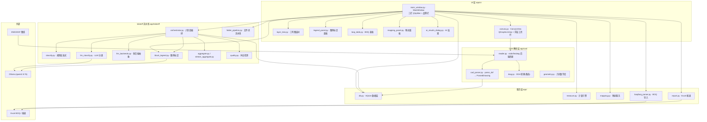
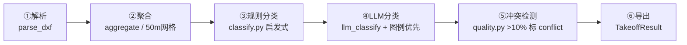

# cad-boq-tool 图纸算量工具 · 详细设计文档

| 项目   | 内容                                      |
| ---- | --------------------------------------- |
| 文档版本 | v1.0（2026-08-24）                        |
| 软件名称 | 图纸算量工具（cad-boq-tool）                    |
| 文档用途 | 面向外部 LLM / 评审专家提供完整技术细节，用于输出优化方案        |
| 文档性质 | 基于源码盘点（约 3300 行核心代码）撰写的事实性设计说明，含待评审问题清单 |

---

## 1. 目标与背景

### 1.1 背景

工程算量（取量）是机电 / 建筑工程造价的核心环节。传统做法是人工在 CAD 中逐个拾取图元、按 BOQ（工程量清单）条目手工映射，费时且易错。本工具面向**电气工程图纸**（照明、插座、UPS、母线、弱电等），提供一条从 DWG/DXF → 结构化实体 → BOQ 映射 → 计量 → Excel 报表的自动化流水线，并引入 **LLM 辅助分类与图例标定**来缓解"图块语义理解难"的问题。

应用场景：利比亚班加西医院等海外项目图纸（全英文图层/块名、约 39 张 DWG/项目、单图最多 4 万+ 实体）。

### 1.2 目标

1. 打开 DWG/DXF（自动选择解析后端），在可视化画布上浏览图层与块。
2. 导入 Excel BOQ，将 CAD 实体/图层/块与 BOQ 条目建立映射，按规则（长度/面积/个数）自动计量。
3. 通过 LLM 辅助对"匿名块"（如 `DFT-RGE-...` 设备块）做语义分类与图例标定，人工复核后固化到项目级图例库。
4. 导出带差值红绿着色的 Excel 报表，支撑投标/结算。

### 1.3 非目标（明确排除，避免评审误读）

- **不处理 Word/PDF 文档**：代码库中不存在 OOXML 修订（w:ins/w:del）、中文 TM 召回（CJK bigram）等模块——这些属于其他翻译/文档项目，与本工具无关。
- **不做三维模型、点云、BIM（IFC）解析**。
- **不做 CAD 图纸编辑/写回**，只读解析。
- **不依赖云端服务**：LLM 默认走本机 Ollama，云后端为可选扩展。

---

## 2. 功能需求

### 2.1 核心用例

| 编号  | 用例            | 触发           | 主流程                                 | 产出                    |
| --- | ------------- | ------------ | ----------------------------------- | --------------------- |
| U1  | 新建/切换项目       | 顶部品牌栏项目下拉    | 建库记录、清空画布                           | 项目上下文                 |
| U2  | 打开图纸（DWG/DXF） | 「打开图纸」按钮     | ParseWorker 后台解析 → 入库 → 渲染          | sheet 记录 + 画布         |
| U3  | 导入 BOQ（xlsx）  | 「导入 BOQ」按钮   | 表头探测 → 结构化入 boq_item                | BOQ 表格                |
| U4  | 手动拾取映射        | 画布点选实体       | 待选池 → 分配至 BOQ 条目                    | mapping 记录            |
| U5  | 图层/块批量映射      | 图层树右键/映射面板   | 按 layer/block 一键关联                  | 批量 mapping            |
| U6  | AI 算量（单图）     | 「AI 算量」按钮    | 六阶段流水线（见 4.4）                       | TakeoffItem 结果 + 冲突标记 |
| U7  | AI 算量（文件夹）    | 「文件夹算量」按钮    | 逐图流式聚合 → LLM 分块 → 去重                | 跨文件汇总                 |
| U8  | 图例 LLM 辅助标定   | 图例面板「LLM 辅助」 | 过滤匿名块 → 分批调 LLM → 解析落库(confirmed=0) | 图例建议表                 |
| U9  | 图例人工复核        | 图例面板内联编辑     | 下拉选择类别/单位/规则，自动落库                   | confirmed 图例          |
| U10 | 在图纸中定位图例块     | 图例行右键「定位」    | 画布闪烁高亮该块所有引用                        | 视觉定位                  |
| U11 | 导出报表          | 「导出」按钮       | measure 计量 → report 生成 xlsx         | 差值着色 Excel            |
| U12 | 图层显隐/隔离       | 图层树复选框/右键    | 画布重绘过滤                              | 视觉过滤                  |

### 2.2 关键功能细节

- **计量规则三型**：`length`（长度合计）/ `area`（面积合计）/ `count`（个数合计），每 BOQ 条目可选，且受缩放因子修正：`因子 = 项目因子 × 图纸因子 × 条目因子`，面积类因子平方。
- **映射三模式**：`entity`（精确到 handle）/ `layer`（整层）/ `block`（整块，自动继承图例的 count 规则）。
- **冲突检测**：跨文件同一 code+unit 的计量值差异 > 10% 时标记 `conflict` 并降权，供人工裁决。
- **图例优先级**：`confirmed=1` 的人工图例 > LLM 建议（confirmed=0）> 启发式规则分类。

---

## 3. 技术规格

### 3.1 技术栈与依赖（当前 venv 实测版本）

| 依赖               | 版本              | 用途                                             |
| ---------------- | --------------- | ---------------------------------------------- |
| Python           | 3.11+           | 运行环境                                           |
| PySide6          | 6.7.2           | GUI（QGraphicsView 画布 / QTableWidget / QThread） |
| ezdxf            | 1.4.4           | DXF 解析后端                                       |
| ezdwg            | 0.12.6          | DWG 直读后端（Rust 实现，免 ODA）                        |
| openpyxl         | 3.1.5           | BOQ 导入 / 报表导出                                  |
| ollama           | 0.6.2           | 本机 LLM 调用（qwen2.5:7b 等）                        |
| httpx / requests | 0.27.2 / 2.34.2 | LLM HTTP 后端                                    |
| numpy            | 2.4.6           | 几何/聚合计算辅助                                      |
| SQLite           | 内置（WAL 模式）      | 持久化                                            |

### 3.2 系统架构



### 3.3 运行环境

- Windows 10/11 桌面（开发机为 Windows，路径含空格与中文，全部代码基于 `pathlib` 处理）。
- 可选：本机 Ollama 服务（默认 `http://localhost:11434`）。
- 数据目录：`~/.cad-boq-tool/projects.db`（单文件 SQLite，WAL 模式）。

### 3.4 配置项（app/config.py）

| 常量                      | 默认值                                       | 说明                                                                    |
| ----------------------- | ----------------------------------------- | --------------------------------------------------------------------- |
| `APP_NAME / VERSION`    | 图纸算量工具 / 0.1.0                            | 品牌与版本                                                                 |
| `DATA_DIR / DB_PATH`    | `~/.cad-boq-tool`                         | 数据目录与库文件                                                              |
| `BIG_DRAWING_THRESHOLD` | 50000                                     | 实体数超过则只渲染可见图层                                                         |
| `ODA_INSTALL_HINTS`     | `C:\Program Files\ODA\ODAFileConverter` 等 | ODA 探测路径（`find_oda_converter` 另支持环境变量 `ODA_FILE_CONVERTER`、D 盘与用户级路径） |
| `BOQ_HEADER_CANDIDATES` | 中英文表头候选集                                  | BOQ 自动探测                                                              |
| `DEFAULT_SCALE_FACTOR`  | 1.0                                       | 默认缩放（mm→m 用 0.001）                                                    |

---

## 4. 实现细节

### 4.1 数据层（app/db.py + app/models.py）

**连接策略**：`get_conn()` 每次操作新建连接、`PRAGMA journal_mode=WAL`、row_factory=Row；建表/迁移在 `init_db()`（`_migrate` 为旧库补列，当前只有 `sheet.blocks_json` 一条迁移）。

**表结构**（SQLite）：

| 表              | 关键列                                                                                                                                                  | 索引 / 约束                                                     |
| -------------- | ---------------------------------------------------------------------------------------------------------------------------------------------------- | ----------------------------------------------------------- |
| `project`      | id, name, created_at, boq_path                                                                                                                       | —                                                           |
| `sheet`        | id, project_id, filename, src_path, dxf_path, status(converting/ready/failed), scale, entity_count, layer_count, **blocks_json**(块几何缓存)              | —                                                           |
| `entity`       | id, sheet_id, handle(**跨会话稳定ID**), dxf_type, layer, block_name, bbox, geom_json, length, area, color                                                 | idx_entity_sheet / (sheet_id,layer) / (sheet_id,block_name) |
| `boq_item`     | id, project_id, row_index, code, description, unit, original_qty, rule_type(length/area/count), scale_factor                                         | idx_boq_project                                             |
| `mapping`      | id, boq_item_id, sheet_id, mode(entity/layer/block), entity_id, layer_name, block_name, created_at                                                   | idx_mapping_item / idx_mapping_entity                       |
| `block_legend` | id, project_id, block_name, category, device_type, spec, unit, count_rule(count/length/manual), confirmed(0/1), source(manual/llm), note, created_at | **唯一索引 (project_id, block_name)**                           |

**主要 API**（节选）：`create_project / list_projects / get_project / update_project_boq / delete_project / add_sheet / get_sheets / replace_entities / get_entities / distinct_layers / distinct_blocks / replace_boq_items / add_mapping / get_mappings / entity_mapped / collect_blocks / get_block_legend_map / save_block_legend / set_block_confirmed`。

**模型**（dataclass）：`Project / Sheet / Entity / BoqItem / Mapping / LayerInfo / BlockInfo`；`BoqItem.mapped_count / measured_qty` 为运行时字段（不入库）。

> ⚠️ 设计观察（供评审）：`entity.bbox/geom_json/color` 以 JSON 文本存储，无法 SQL 范围查询；`delete_project` 仅级联删除 mapping/boq_item，**未删除 sheet/entity**（孤儿数据）；所有表无外键约束。

### 4.2 CAD 解析层（app/cad/）

| 文件              | 职责与关键实现                                                                                                                                                                                                                                                                        |
| --------------- | ------------------------------------------------------------------------------------------------------------------------------------------------------------------------------------------------------------------------------------------------------------------------------ |
| `reader.py`     | 后端桥接抽象：`_DocWrapper / _MspWrapper / _EntityWrapper / _DxfProxy` 统一 ezdxf 与 ezdwg 的 API 差异。`read_cad(path)` 按后缀选后端（DXF→ezdxf，DWG→ezdwg）；`read_cad_smart` 为 ezdwg 失败时 ODA→DXF fallback 的完整链路。ezdwg 预建 layer_handle→name 缓存，规避其 Rust 层 panic。                                     |
| `cad_parser.py` | `parse_dxf(path, progress_cb)` → `ParsedDrawing(entities/layers/layer_colors/blocks/block_refs/blocks_with_count)`；`_entity_geom` 处理 10 种几何类型（LINE/LWPOLYLINE/POLYLINE/ARC/CIRCLE/SPLINE/ELLIPSE/INSERT/HATCH/TEXT/MTEXT/POINT），产出 (geom, length, area, bbox)；进度回调每 1000 实体一次。 |
| `dwg.py`        | ODA CLI 封装：`find_oda_converter()`（环境变量 > PATH > 常见目录，含版本子目录 glob）；`convert_dwg_to_dxf(dwg, out_dir, version="ACAD2018")`，失败时抛 RuntimeError 携带 returncode/stdout/stderr。                                                                                                        |
| `geometry.py`   | 纯函数几何库：`dist2d / arc_length / bulge_to_arc_length / polyline_length / closed_polyline_area / spline_length / bbox_of_points`。                                                                                                                                                  |

**DWG 打开策略（v1.1 修复后）**：`ParseWorker.run()` 对 `.dwg` **优先 ezdwg 直读**（`parse_dxf` 自动选后端，实测 6024 实体约 47s）；仅当直读抛异常才回退 ODA 转换；两者皆失败时错误信息携带完整诊断（ezdwg 错误 + ODA 未安装提示 + 下载地址）。

### 4.3 计量 / 映射 / BOQ / 报表

| 模块                      | 关键函数                                                                                                  | 说明                                                             |
| ----------------------- | ----------------------------------------------------------------------------------------------------- | -------------------------------------------------------------- |
| `app/measure.py`        | `compute_entity_qty / compute_item`                                                                   | 因子=项目×图纸×条目，面积因子平方；按 rule_type 从 Entity.length/area 或 count 聚合 |
| `app/mapping.py`        | `add_entity_mapping / add_layer_mapping / add_block_mapping / mapped_entity_ids / resolve_entity_ids` | 三种模式统一入 mapping 表；块映射自动带出图例 count 规则                           |
| `app/boq/boq_parser.py` | `parse_boq(xlsx)`                                                                                     | openpyxl 读取，前 5 行探测中文/英文表头 → BoqItem[]                         |
| `app/report.py`         | `export_report / export_items_to_excel`                                                               | 8 列差值报表，超出/未达红绿着色；AI 结果按置信度着色                                  |

### 4.4 AI 算量流水线（app/takeoff/）

**单图流水线 `takeoff_pipeline(config)` 六阶段**：



| 阶段       | 模块                                    | 要点                                                                                                                                                   |
| -------- | ------------------------------------- | ---------------------------------------------------------------------------------------------------------------------------------------------------- |
| ① 解析     | orchestrator → cad_parser             | 复用解析层，进度回调                                                                                                                                           |
| ② 聚合     | `aggregate.py`                        | `AggregatedDrawing(layers/regions 50m 网格/block_inserts/typical_sizes)`；`extract_typical_sizes` 用正则提取 DN/Φ/×/SC 规格                                    |
| ③ 规则分类   | `classify.py`                         | `classify_layer / classify_block / get_top_category`，基于 LAYER_RULES/BLOCK_RULES 关键词启发式                                                               |
| ④ LLM 分类 | `llm_classify.py` + `llm_backends.py` | `build_prompt` 注入**人工已确认图例（最高优先级）**；`llm_classify_ollama`（温度 0.1，num_predict 4000）；`parse_json_robust` 三重解析容错；`_block_takeoff_item` 优先取 confirmed 图例 |
| ⑤ 冲突检测   | `quality.py`                          | `reconcile_across_files`（code+unit 累加）；`detect_conflicts`（差异>10% 降权标记）                                                                               |
| ⑥ 导出     | orchestrator → TakeoffResult          | `TakeoffItem` 列表                                                                                                                                     |

**文件夹流水线 `run_folder_pipeline`**：扫描（自然序）→ 逐图 `aggregate_file_streaming` 流式聚合 → `stream_aggregate.AggregatedProject.to_llm_chunks`（约 24K token 智能分块，trade×floor 维度）→ 去重与冲突。

**多 LLM 后端 `llm_backends.py`**：`LLMBackend` 抽象 + Ollama / DashScope / OpenAI / DeepSeek / Custom 实现；`create_backend` / `estimate_cost`。

**图例标定 `block_legend.py`（核心）**：

- 常量：`CATEGORIES / COUNT_RULES / UNITS`，`LLM_BATCH_SIZE=20`，`LLM_NUM_PREDICT=8192`。
- `llm_suggest_legend(blocks, project_type, specialty, model, host, timeout, existing, progress_cb)`：
  1. **过滤匿名块**（`*` 开头 / 空名，如 `*U`），按引用次数降序；
  2. 每批 20 块调用 LLM，单批失败不终止（progress_cb 报批进度 i/N）；
  3. `parse_suggestions` **两遍扫描**容错：先剥 \`\`\`json 围栏整体解析；失败则扫描顶层平衡对象（兼容 LLM 输出多个独立 `{"legend":[...]}` 文档）+ 任意深度扁平条目对象（救截断输出）；
  4. `apply_suggestions` 尊重 `confirmed=1` 的既有条目（不覆盖人工结论）。
- 动机：qwen2.5:7b 实测在超长上下文下输出多文档/截断 JSON，旧解析器只取首个平衡块导致 20 块只入库 1 条；修复后 80 块/4 批端到端 **80/80 满产出**。

### 4.5 UI 层（app/ui/）

| 文件                       | 结构 / 关键点                                                                                                                                                                                           |
| ------------------------ | -------------------------------------------------------------------------------------------------------------------------------------------------------------------------------------------------- |
| `main_window.py`（1257 行） | 顶部品牌栏（项目下拉/新建/打开/导入/AI算量/导出/图例标定）；三栏 `QSplitter`（左=图纸列表+LayerTree，中=CanvasView+浮层，右=QTabWidget[BoqTable/MappingPanel/LegendPanel]）；`LIGHT_QSS` 浅色主题（白 #FFFFFF / 淡灰 #F4F6F9 / 腾讯蓝 #185FA5）；状态栏常驻统计  |
| `canvas.py`              | `CanvasView`（QGraphicsView，24px 淡灰点阵背景）；`_do_flash` 用 QTimer.singleShot 链式闪烁（**备份 pen/brush → 交替换色 → 恢复**，恢复用 enumerate+skip 无 pen 项）；信号 `entityPicked / entitiesPicked / entityHovered`；缺块定义画红叉占位 |
| `canvas_toolbar.py`      | 画布浮层工具栏：模式/缩放/主题/全屏/左右栏折叠/实体类型过滤，9 个 Signal                                                                                                                                                        |
| `layer_tree.py`          | **三列布局**：列0=「■」色块（22px，取图层色）｜列1=名称+数量｜列2=显隐复选框（26px 独占）；右键菜单（Isolate/锁定/颜色覆盖/关联）；`itemChanged` 仅在 `__init__` 连接一次                                                                                  |
| `legend_panel.py`        | 8 列 QTableWidget + `_ComboDelegate`（类别/单位/规则下拉）；`cellChanged` 自动落库；工具栏 LLM 辅助（批量进度）/确认全部/仅看未标定/导入导出 JSON；右键「在图纸中定位」                                                                                |
| `boq_table.py`           | 8 列 BOQ 表，规则列 QComboBox，`_flash_row` 行闪烁，`itemSelected / ruleChanged / scaleChanged`                                                                                                               |
| `mapping_panel.py`       | 映射列表 + 计量结果 + 删除/重算/导出                                                                                                                                                                             |
| `selection_bar.py`       | 待选计数 + 分配/清空 + 缩放显示                                                                                                                                                                                |
| `ai_results_dialog.py`   | 置信度绿/橙/红着色 + 冲突加粗，筛选/搜索/接受/拒绝/导出                                                                                                                                                                   |

> ⚠️ 已修复的坑（记录在案，防回归）：`setItemDelegateForColumn` 传入的临时委托对象若无 Python 引用且无 parent，会被 GC 回收 → C++ 悬垂指针 → 拖动滚动条段错误（Windows 真实平台复现，offscreen 不触发）。修复：委托存为 `self._cat_delegate` 等属性并传 `parent=self.table`。

### 4.6 线程模型

```mermaid
flowchart LR
    UI["UI 线程<br/>MainWindow/画布"] -->|start| P["ParseWorker QThread<br/>解析图纸"]
    UI -->|start| A["_AiTakeoffWorker<br/>单图算量"]
    UI -->|start| F["_AiTakeoffFolderWorker<br/>文件夹算量"]
    UI -->|start| L["_LegendSuggestWorker<br/>图例LLM标定"]
    P -->|progress/done/failed| UI
    A & F -->|progress(phase,p,msg)/finished_ok/failed| UI
    L -->|progress(批次i/N)/finished_ok/failed| UI
```

- 所有耗时操作（解析、AI 算量、LLM 标定）均在 QThread；UI 通信**仅通过 Signal**（进度/结果/错误）；`QProgressDialog` 只显示进度。
- Ollama 可达性在 worker `run()` 内探测（不阻塞 UI 启动）。

### 4.7 关键容错与性能策略

| 场景            | 策略                                                                 |
| ------------- | ------------------------------------------------------------------ |
| LLM 输出畸形 JSON | 三重解析 + 两遍扫描（见 4.4）                                                 |
| LLM 单批失败      | 不终止整轮，记录并继续                                                        |
| 大图渲染          | `BIG_DRAWING_THRESHOLD=50000` 只渲染可见图层                              |
| 重复打开图纸        | `sheet.blocks_json` 缓存块几何，免重新解析                                    |
| DWG 无 ODA     | ezdwg 直读优先（见 4.2）                                                  |
| 测试污染正式库       | `_test_db.py` 在 `from app import db` 前将 `config.DB_PATH` 指到 temp 库 |

---

## 5. I/O 规范

### 5.1 输入

| 输入   | 格式                                   | 说明                                |
| ---- | ------------------------------------ | --------------------------------- |
| 图纸   | `.dwg`（R14–R2018）/ `.dxf`（R12–R2018） | 多选或文件夹；DWG 优先 ezdwg 直读，回退 ODA     |
| BOQ  | `.xlsx`（openpyxl）                    | 表头前 5 行自动探测（中文/英文），字段：编号/描述/单位/数量 |
| 图例导入 | JSON（`legend_panel` 导出格式）            | 与 block_legend 表字段对应              |

### 5.2 输出

| 输出      | 格式                       | 内容                                     |
| ------- | ------------------------ | -------------------------------------- |
| 报表      | `.xlsx`                  | 8 列（编号/描述/单位/清单量/计算量/差值/偏差率/状态），差值红绿着色 |
| AI 算量结果 | 内存 `TakeoffItem[]` + 对话框 | 置信度着色、冲突加粗，可接受/拒绝后落库                   |
| 图例导出    | JSON                     | 类别/设备类型/规格/单位/规则/确认状态                  |

### 5.3 错误与异常规范

- 解析失败：ParseWorker 捕获 → `_on_parse_failed` 弹窗；含 "DWG" 或 "ODA" 关键词时提示安装指引。
- LLM 失败：`_LegendSuggestWorker` 把错误 + traceback 透传到 failed 信号。
- 异常统一 `except Exception` 兜底并携带上下文（不静默吞错）；ODA 转换失败带 returncode/stdout/stderr。

---

## 6. 验收标准

### 6.1 自动化测试矩阵（当前全绿）

| 脚本                   | 覆盖                                           | 状态         |
| -------------------- | -------------------------------------------- | ---------- |
| `test_core.py`       | 解析→入库→映射→计量→导出 无头链路                          | ALL PASSED |
| `test_e2e.py`        | A–F 验收段：计量精度<1%、冲突拦截、持久化、导出                  | 17/17 PASS |
| `test_legend.py`     | block_legend CRUD + 跨图聚合 + LLM 建议不覆盖已确认 + 解析 | PASS       |
| `test_ai_takeoff.py` | takeoff_pipeline PoC                         | PASS       |
| `gui_smoke.py`       | offscreen 冒烟 G1–G9（含 6024 实体大图渲染）            | 9/9 PASS   |
| pyflakes             | 全模块静态检查                                      | 0 警告       |

### 6.2 人工验收清单

1. 打开 39 张 DWG 项目全部成功，画布可缩放/平移/选点。
2. 图例 LLM 标定：215 命名块分批（约 11 批）全部产出，匿名块被过滤；人工确认后不会被 LLM 覆盖。
3. 图层树：色块/文字/复选框三列不重叠，复选框切换只发一次信号。
4. 图例滚动条拖动不闪退（修复回归项）。
5. 跑完所有测试后正式库保持 0 行（隔离生效）。

---

## 7. 已知问题 / 设计权衡 / 待评审清单

> 以下是**最有价值的评审抓手**，请外部 LLM 针对这些点输出优化方案：

### A. 数据层

1. **`delete_project` 不删 sheet/entity**：仅级联 mapping/boq_item，删除项目会遗留孤儿图纸与实体数据（占库最大）。
2. **无外键约束**：所有表靠应用层维护引用一致性，删改易产生悬挂引用。
3. **entity 大字段 JSON 化**：bbox/geom_json/color 为 TEXT，无法做空间/范围 SQL 查询，10 万+ 实体全表扫。
4. **单库多项目**：`~/.cad-boq-tool/projects.db` 单一文件，历史 66 个测试项目使库膨胀至 70MB；无归档/瘦身机制。
5. **连接管理**：每操作新建连接（WAL），高频 UI 刷新时连接开销与并发写竞争待评估。

### B. CAD 解析

1. **ezdwg 大图性能**：6024 实体约 47s，全项目 39 图串行解析预计 30 分钟级；无多线程并行、无解析缓存持久化（blocks_json 仅缓存块几何）。
2. **BIG_DRAWING_THRESHOLD 只控制渲染**：解析与入库仍全量，大图内存峰值高。
3. **ODA 依赖未落地**：环境变量探测已支持，但缺少安装引导/版本校验。

### C. LLM 集成

1. **串行分批**：图例标定 20 块/批串行，215 块约 5–8 分钟；无并发、无超时重试、无背压。
2. **强依赖 qwen2.5 输出形态**：多文档/截断 JSON 的容错解析器复杂度高（两遍扫描），换模型（如 DeepSeek）后行为可能漂移，缺少输出 schema 校验（JSON Schema）。
3. **无成本/时延观测**：`estimate_cost` 有雏形但无日志落盘、无 token 统计持久化。
4. **LLM 结果无版本化**：同一批块重复标定会产生新建议行，无 diff/审计轨迹（除 confirmed 保护外）。

### D. UI / 架构

1. **ParseWorker 无取消机制**：解析中途不可取消，误选大图只能等待。
2. **QThread 每次 new**：4 个 worker 每次操作新建线程，无线程池复用。
3. **全局状态集中在 MainWindow**：`_project_id/_sheet_id/_mode` 等散落实例属性，状态机隐式；建议引入状态容器/ViewModel。
4. **测试隔离靠 monkeypatch**：`_test_db.py` 改 `config.DB_PATH` 是模块级 hack，多进程/并发测试不安全；建议 conftest fixture + 进程级临时库。
5. **无日志系统**：logging 仅 console warning，无文件日志/级别配置/轮转，生产排障困难。
6. **i18n 缺失**：界面中文硬编码；海外项目（利比亚）可能有英文界面需求。

### E. 功能缺口

1. 图例 `count_rule=length` 时按块几何计量的实现未完成（待接入 measure）。
2. 无撤销/重做；无自动保存（数据库直接写，崩溃中间态无事务保护）。
3. 报表导出格式固定，无模板化/自定义列配置。

---

## 8. 建议演进方向（供评审参考，非承诺）

1. 数据层：补外键 + 级联删除 + entity 按 sheet 分区表 + 归档。
2. 解析层：多进程并行解析 + 磁盘级解析缓存（hash(src_path, mtime) → .parquet/JSON）。
3. LLM：并发分批 + 指数退避重试 + JSON Schema 校验 + 结果 diff 审计。
4. UI：状态容器化 + 可取消任务（QFuture/cancellation token）+ 线程池。
5. 可观测性：logging 文件落盘 + 指标（解析耗时/LLM token/冲突率）。
6. 打包：PyInstaller 单文件 + 自动 ODA 检测向导。

---

## 附录 A：文件索引（行数）

| 文件                                                                                                                   | 行数   | 职责                       |
| -------------------------------------------------------------------------------------------------------------------- | ---- | ------------------------ |
| app/ui/main_window.py                                                                                                | 1257 | 主窗口 + 4 个 QThread worker |
| app/ui/canvas.py                                                                                                     | 718  | 画布与闪烁高亮                  |
| app/db.py                                                                                                            | 408  | 数据层                      |
| app/cad/cad_parser.py                                                                                                | 326  | 实体解析                     |
| app/takeoff/orchestrator.py                                                                                          | 309  | 算量编排                     |
| app/takeoff/block_legend.py                                                                                          | 309  | 图例标定                     |
| app/cad/reader.py                                                                                                    | ~455 | 后端桥接                     |
| app/cad/dwg.py                                                                                                       | ~70  | ODA 转换                   |
| app/cad/geometry.py                                                                                                  | —    | 几何库                      |
| app/measure.py / mapping.py / report.py                                                                              | —    | 计量/映射/报表                 |
| app/boq/boq_parser.py                                                                                                | —    | BOQ 导入                   |
| app/takeoff/{classify,llm_classify,llm_backends,aggregate,stream_aggregate,quality,context_infer,folder_pipeline}.py | —    | 流水线各阶段                   |
| app/ui/{canvas_toolbar,layer_tree,legend_panel,boq_table,mapping_panel,selection_bar,ai_results_dialog}.py           | —    | 界面组件                     |
| main.py                                                                                                              | —    | 入口                       |
| test\_{core,e2e,legend,ai_takeoff}.py / gui_smoke.py / \_test_db.py                                                  | —    | 测试                       |

## 附录 B：运行与测试命令

# cad-boq-tool V2 架构优化与 BOQ 智能绑定改造任务

## 一、项目背景

当前项目是一个已经完成 V1 的桌面端 CAD 工程量计算工具：

> 软件名称：cad-boq-tool

当前版本设计说明书：

> DETAILED_DESIGN_2026-08-24.md

项目当前已经实现约 3300 行核心代码，具备：

- DWG / DXF 读取
- `ezdwg` DWG 直读
- ODA DXF fallback
- ezdxf DXF 解析
- CAD Entity 入库
- Layer / Block 管理
- BOQ Excel 导入
- entity / layer / block 三种映射
- length / area / count 三类计量
- LLM 分类
- Block Legend
- Ollama
- AI 算量
- Excel 导出
- 人工复核
- 多图/文件夹算量
- 自动化测试

当前设计文档中的核心链路是：

```text
DWG/DXF
→ 结构化实体
→ BOQ映射
→ 计量
→ Excel
```

当前代码已经证明 DWG 可优先通过 `ezdwg` 直读，失败时可 fallback 到 ODA；当前测试中 6024 实体 DWG 约 47 秒。

---

# 二、本次任务的核心方向调整

本次不要推倒重做。

也不要继续简单强化：

```text
DWG
→ LLM
→ 自动算量
```

改成更可靠的：

```text
DWG
→ CAD Entity
→ Engineering Object
→ BOQ Candidate
→ LLM Binding
→ Human Review
→ Confirmed Binding
→ Deterministic Quantity
→ BOQ
```

核心原则：

> **LLM负责语义识别和BOQ绑定，不负责精确几何计算。**

---

# 三、目标架构

目标升级为：

```text
DWG / DXF
                             │
                             ▼
                    ┌──────────────────┐
                    │    CAD Parser    │
                    │ ezdwg / ezdxf / ODA │
                    └────────┬─────────┘
                             │
                             ▼
                     CAD Entity Database
                             │
              ┌──────────────┼──────────────┐
              │              │              │
              ▼              ▼              ▼
            Block          Layer           Text
              │              │              │
              └──────────────┼──────────────┘
                             ▼
                    Engineering Object
                             │
                             ▼
                    Candidate Generator
                             │
                 ┌───────────┴───────────┐
                 │                       │
                 ▼                       ▼
          Rule / Exact Match       Semantic Match
                 │                       │
                 └───────────┬───────────┘
                             ▼
                       Candidate BOQ
                             │
                             ▼
                       Qwen Reranking
                             │
                             ▼
                    Binding Recommendation
                             │
                             ▼
                       Human Review
                             │
                 ┌───────────┴───────────┐
                 │                       │
              Reject                  Confirm
                 │                       │
                 ▼                       ▼
            下一候选项             Confirmed Binding
                                         │
                                         ▼
                              Deterministic Quantity
                                         │
                                         ▼
                                      BOQ Result
                                         │
                                         ▼
                                    Excel Report
```

---

# 四、第一阶段：先审查现有代码，不要立即修改

首先完整检查当前代码。

重点阅读：

```text
app/db.py
app/models.py
app/cad/reader.py
app/cad/cad_parser.py
app/cad/dwg.py
app/cad/geometry.py
app/measure.py
app/mapping.py
app/boq/boq_parser.py
app/report.py
app/takeoff/orchestrator.py
app/takeoff/classify.py
app/takeoff/llm_classify.py
app/takeoff/llm_backends.py
app/takeoff/block_legend.py
app/takeoff/aggregate.py
app/takeoff/stream_aggregate.py
app/takeoff/quality.py
app/ui/legend_panel.py
app/ui/mapping_panel.py
app/ui/boq_table.py
app/ui/ai_results_dialog.py
```

重点判断哪些现有模块可以直接复用。

不得为了实现新功能而重复实现：

- DWG解析
- DXF解析
- Block读取
- Entity读取
- Geometry计算
- BOQ读取
- Excel导出

优先扩展现有实现。

---

# 五、第二阶段：重新定义核心数据模型

当前：

```text
entity
mapping
boq_item
block_legend
```

的结构可以保留，但必须增加“绑定候选”和“正式绑定”的概念。

建议增加：

## 1. engineering_object

用于描述 CAD 中具有工程意义的对象。

建议字段：

```text
id
project_id
sheet_id
entity_id
object_type
discipline
system
subsystem
block_name
layer_name
tag
specification
material
unit
quantity_rule
confidence
source
created_at
updated_at
```

例如：

```json
{
  "object_type": "equipment",
  "discipline": "ELV",
  "system": "CCTV",
  "block_name": "CAM_DOME",
  "layer_name": "ELV-CCTV",
  "specification": "4MP Dome Camera",
  "unit": "No.",
  "quantity_rule": "count"
}
```

---

# 六、第三阶段：新增 Binding Candidate

不要直接让 LLM 修改正式 mapping。

增加：

```text
binding_candidate
```

建议字段：

```text
id
project_id
engineering_object_id
boq_item_id
method
score
confidence
reason
model
model_version
prompt_version
status
created_at
```

status：

```text
PENDING
ACCEPTED
REJECTED
SUPERSEDED
```

method：

```text
RULE
EMBEDDING
LLM
MANUAL
```

---

# 七、第四阶段：正式 Binding

现有 `mapping` 表继续作为正式绑定表。

但是明确：

```text
binding_candidate
        ↓
人工确认
        ↓
mapping
```

也就是说：

### AI不能直接写入最终 mapping。

只有：

```text
人工确认
```

或者：

```text
确定性规则自动通过
```

才能进入正式 mapping。

这样避免 AI 错误污染正式工程量。

---

# 八、第五阶段：保留现有三种 Mapping 模式

当前已有：

```text
entity
layer
block
```

这一设计继续保留。

但明确优先级：

```text
entity
>
block
>
layer
```

推荐解释：

### entity

最高精度：

```text
单个CAD实体
→ BOQ
```

### block

适合：

```text
设备类
```

例如：

```text
CAM_DOME
AP_CEILING
SMOKE_DETECTOR
```

### layer

适合：

```text
大量同类线性对象
```

例如：

```text
P-FIRE-DN100
P-WATER-DN50
M-DUCT
E-CABLE
```

---

# 九、第六阶段：重新设计 AI Binding Pipeline

当前 `block_legend.py + llm_classify.py` 已经是非常好的基础。

不要删除。

将其升级成：

```text
① CAD对象提取
② 规则过滤
③ 候选BOQ召回
④ Embedding语义召回
⑤ Qwen重排序
⑥ 结构化输出
⑦ Confidence评估
⑧ 人工复核
⑨ 固化绑定
```

---

# 十、第一层：规则候选过滤

不要把整个 BOQ 给 Qwen。

例如：

```text
Layer = ELV-CCTV
```

优先过滤：

```text
discipline = ELV
system = CCTV
```

如果：

```text
Block = CAM_DOME
```

进一步过滤：

```text
object_type = camera
```

最终：

```text
5000 BOQ Items
→
8 Candidates
```

再交给 AI。

---

# 十一、第二层：Embedding召回

优先支持 Ollama 本地 embedding。

需要预留 embedding provider：

```python
EmbeddingProvider
```

至少支持：

```text
Ollama
```

后续再扩展其他服务。

CAD对象生成：

```text
CAM_DOME
ELV-CCTV
Dome Camera
4MP
```

BOQ生成：

```text
IP Camera
4MP Dome Camera
PoE
Indoor
```

计算语义相似度。

只保留 Top-N，例如：

```text
Top 5
```

---

# 十二、第三层：Qwen重排序

Qwen只接收：

```text
CAD Object
+
Nearby Text
+
Layer
+
Block
+
Attributes
+
Top-N BOQ Candidates
```

不要把整张 DWG 转给 LLM。

要求模型返回严格 JSON。

结构建议：

```json
{
  "selected_boq_id": "ELV-CCTV-001",
  "confidence": 0.96,
  "reason": "Block name, layer and specification indicate a 4MP dome camera.",
  "alternative_boq_ids": [
    "ELV-CCTV-002"
  ],
  "needs_review": true
}
```

---

# 十三、必须增加 JSON Schema 校验

不能继续完全依赖当前的：

```text
parse_json_robust()
```

当前项目已经针对 Qwen 输出截断和多文档进行了复杂容错，这是很好的防御措施，但下一步应该增加：

```text
JSON Schema
+
Pydantic
+
业务字段校验
```

流程：

```text
LLM
 ↓
JSON Schema
 ↓
Pydantic
 ↓
业务校验
 ↓
Binding Candidate
```

如果失败：

```text
自动重试
```

---

# 十四、第四层：人工复核

增加明确的“绑定审核界面”。

例如：

```text
CAD对象：

Block: CAM_DOME
Layer: ELV-CCTV
Spec: 4MP

AI推荐：

BOQ-001
4MP Dome Camera
Confidence: 96%

候选：

BOQ-002
8MP Dome Camera
92%

BOQ-003
4MP Bullet Camera
63%

[确认 BOQ-001]
[选择 BOQ-002]
[手动选择其他BOQ]
[拒绝]
```

人工确认后：

```text
binding_candidate
        ↓
mapping
        ↓
quantity recompute
```

---

# 十五、人工绑定必须成为 AI 的长期知识来源

用户第一次手动：

```text
CAM_DOME
→
BOQ-001
```

系统保存：

```text
project_id
block_name
layer
device_type
specification
boq_item_id
```

以后相同项目再次出现：

```text
CAM_DOME
```

优先：

```text
已有确认绑定
```

再考虑：

```text
规则
Embedding
LLM
```

优先级建议：

```text
项目级人工确认
>
项目级规则
>
全局规则
>
Embedding
>
LLM
>
通用启发式
```

---

# 十六、重构 Block Legend

当前 `block_legend` 很重要，但不要让它同时承担：

```text
设备分类
+
BOQ绑定
+
计量规则
```

建议拆分逻辑：

```text
Block Legend
=
“这个CAD块是什么”

Binding
=
“这个CAD块对应哪个BOQ”

Measurement Rule
=
“这个BOQ怎么计算”
```

例如：

```text
CAM_DOME

Legend:
device_type = camera
system = CCTV
spec = 4MP Dome Camera

Binding:
boq_id = ELV-CCTV-001

Measurement:
rule = count
unit = No.
```

这样架构更清晰。

---

# 十七、计量引擎继续保持确定性

当前：

```text
length
area
count
```

机制继续保留。

进一步明确：

### Count

```text
Block / Entity 数量
```

### Length

```text
Polyline / Line / Arc / Spline
```

### Area

```text
Closed Polyline / Hatch / Geometry
```

所有最终 Quantity 由 Python 计算。

LLM不得直接返回最终工程量。

---

# 十八、完善“工程对象 → Quantity”关系

例如：

```text
CAM_DOME
→ Engineering Object
→ count
→ 126
```

或者：

```text
P-FIRE-DN100
→ Engineering Object
→ length
→ 1826.42m
```

最终：

```text
Engineering Object
+
Measurement Rule
→
Quantity
```

---

# 十九、必须增加完整溯源

任何 BOQ 数量必须能够追溯到：

```text
BOQ Item
↓
Confirmed Binding
↓
Engineering Object
↓
CAD Entity
↓
Entity Handle
↓
Sheet
↓
DWG
↓
Layer
↓
Block
↓
Coordinate
```

例如：

```text
BOQ-001
Quantity = 126

Source:
Hospital-A-Level-01.dwg
Layer = ELV-CCTV
Block = CAM_DOME
Entity IDs = [...]
```

UI 中增加：

```text
查看来源
```

点击后：

```text
打开对应图纸
+
定位实体
+
高亮
```

---

# 二十、数据库优化同时实施

当前设计已经明确存在以下问题：

- 删除项目产生孤儿 sheet/entity
- 无外键
- JSON字段不能做空间查询
- 单库越来越大
- 高频操作连接成本
- 缺少审计日志

这次不要过度重构，但至少完成：

### 1. 外键

开启：

```sql
PRAGMA foreign_keys = ON;
```

### 2. cascade delete

project  
→ sheet  
→ entity  
→ mapping  
→ candidate

### 3. 增加索引

至少：

```text
(entity.sheet_id, entity.layer)
(entity.sheet_id, entity.block_name)
(mapping.boq_item_id)
(binding_candidate.engineering_object_id)
(binding_candidate.boq_item_id)
```

### 4. 不急于引入空间数据库

第一阶段 SQLite 足够。

---

# 二十一、LLM版本化和审计

当前已知问题之一是：

> 同一批块重复标定会产生新建议，没有完整 diff/审计轨迹。

本次增加：

```text
llm_run
```

建议字段：

```text
id
project_id
task_type
model
model_version
prompt_version
temperature
input_hash
output_hash
duration_ms
token_input
token_output
status
error
created_at
```

同时 Candidate 保存：

```text
llm_run_id
```

这样以后能回答：

> “这个 BOQ 绑定是哪个模型、哪版 Prompt、什么时候生成的？”

---

# 二十二、Qwen模型不要写死

当前默认是：

```text
qwen2.5:7b
```

保留默认值，但把模型从业务逻辑中抽离：

```text
MODEL_PROVIDER
MODEL_NAME
EMBEDDING_MODEL
TEMPERATURE
TIMEOUT
MAX_TOKENS
```

允许配置：

```text
qwen2.5:7b
qwen3
其他本地模型
```

---

# 二十三、必须支持“LLM关闭”模式

整个系统即使：

```text
Ollama未安装
```

仍然应该可以完成：

```text
DWG
→
CAD Object
→
Manual Binding
→
Quantity
→
BOQ
→
Excel
```

这是必须保证的。

LLM应该是：

```text
辅助能力
```

而不是：

```text
核心依赖
```

---

# 二十四、性能优化优先级

当前已经发现：

> 6024实体约47秒；39张图串行预计30分钟级。

本次不要马上做复杂并发。

优先：

### 1. DWG解析缓存

基于：

```text
absolute_path
mtime
file_size
sha256
parser_version
```

生成 cache key。

---

### 2. 解析结果持久化

建议：

```text
cache/
  drawing_hash/
    entities.parquet
    blocks.json
    metadata.json
```

SQLite主要存索引和业务数据。

---

### 3. 图纸级并行

后续再支持：

```text
Sheet 1 ┐
Sheet 2 ├→ Process Pool
Sheet 3 ┤
Sheet 4 ┘
```

不要在第一步做 entity 级并行。

---

# 二十五、把现有 AI Takeoff 改造成两个模式

不要删掉现有模式。

改为：

## 模式A：AI绑定模式

```text
识别 CAD 对象
→ 推荐 BOQ
→ 人工审核
```

这是主要模式。

## 模式B：规则算量模式

```text
已确认 Mapping
→ 确定性计量
→ BOQ
```

这是最终正式产出模式。

---

# 二十六、建议 UI 增加“绑定工作台”

当前：

```text
BOQ
Mapping
Legend
AI Result
```

建议整合成一个：

```text
Binding Workbench
```

左侧：

```text
CAD Objects
```

中间：

```text
CAD Canvas
```

右侧：

```text
BOQ Candidates
```

工作流：

```text
选择CAD对象
↓
显示对象属性
↓
显示AI推荐
↓
选择/确认BOQ
↓
保存Binding
↓
重新计算
```

但不要重做现有 UI，优先用现有：

```text
mapping_panel
legend_panel
ai_results_dialog
canvas
```

组合扩展。

---

# 二十七、第一版只验证三类工程对象

不要一次扩展整个医院。

V2 POC先实现：

## 设备类

```text
Block
→ Count
→ BOQ
```

例如：

```text
CCTV
AP
Lighting
Fire Alarm Detector
```

## 线性类

```text
Polyline
→ Length
→ BOQ
```

例如：

```text
Pipe
Cable
Cable Tray
```

## 面积类

```text
Closed Polyline
→ Area
→ BOQ
```

例如：

```text
Room
Duct
Floor Area
```

---

# 二十八、验收测试必须新增

新增：

```text
test_binding.py
```

至少测试：

### A. 手动绑定

```text
CAD Block
→ BOQ
→ Count
```

### B. AI候选

```text
CAD Object
→ Top-N candidates
```

### C. Qwen结构化输出

```text
Valid JSON
Invalid JSON
Missing field
Wrong BOQ ID
```

### D. 人工确认

```text
Candidate
→ mapping
```

### E. 人工拒绝

```text
Candidate
→ REJECTED
```

### F. 已确认绑定不被AI覆盖

### G. 同一项目重复出现同一Block时自动复用历史确认结果

### H. BOQ数量反查CAD来源

### I. 删除项目不产生孤儿数据

### J. LLM关闭时整个Manual Binding流程仍可工作

---

# 二十九、不要修改现有验收标准导致回归

现有测试：

```text
test_core.py
test_e2e.py
test_legend.py
test_ai_takeoff.py
gui_smoke.py
```

目前均为通过状态。

每一次修改后必须重新执行：

```bash
.venv\Scripts\python.exe test_core.py
.venv\Scripts\python.exe test_e2e.py
.venv\Scripts\python.exe test_legend.py
.venv\Scripts\python.exe test_ai_takeoff.py
.venv\Scripts\python.exe gui_smoke.py
.venv\Scripts\python.exe -m pyflakes app/
```

新增：

```bash
.venv\Scripts\python.exe test_binding.py
```

---

# 三十、开发原则

## 原则1

不要删除已有功能。

## 原则2

不要为了“架构漂亮”而重写已经稳定的 CAD parser。

## 原则3

优先增加新模块，而不是修改大量旧模块。

## 原则4

LLM永远不是最终工程量计算器。

## 原则5

Manual Binding 必须完整可用。

## 原则6

AI只能生成 Candidate。

## 原则7

Confirmed Binding 才能进入正式 Quantity。

## 原则8

所有结果必须可追溯到 CAD Entity。

## 原则9

LLM关闭时系统仍然可用。

## 原则10

优先支持：

```text
设备Block
线性Polyline
面积Geometry
```

---

# 三十一、推荐新增模块结构

建议逐步新增：

```text
app/
├── binding/
│   ├── __init__.py
│   ├── candidate.py
│   ├── matcher.py
│   ├── rule_matcher.py
│   ├── embedding_matcher.py
│   ├── llm_matcher.py
│   ├── reviewer.py
│   └── resolver.py
│
├── engineering/
│   ├── __init__.py
│   ├── object_model.py
│   ├── extractor.py
│   ├── classifier.py
│   └── specification.py
│
├── llm/
│   ├── schema.py
│   ├── prompts.py
│   ├── runner.py
│   ├── audit.py
│   └── embeddings.py
│
└── takeoff/
    └── ...
```

不要删除已有：

```text
app/takeoff/
app/cad/
app/measure.py
app/mapping.py
app/boq/
```

而是逐步让新模块调用旧模块。

---

# 三十二、最终 V2 数据关系

目标关系：

```text
Project
 │
 ├── Sheet
 │    └── Entity
 │         └── EngineeringObject
 │
 ├── BOQ Item
 │
 ├── BindingCandidate
 │        └── BOQ Item
 │
 └── Confirmed Mapping
          ├── EngineeringObject / Entity
          └── BOQ Item
```

Quantity：

```text
Confirmed Mapping
      ↓
Measurement Rule
      ↓
Quantity
```

---

# 三十三、最终交付目标

本轮不要追求“医院所有专业都自动算完”。

首先完成：

```text
真实 DWG
 ↓
解析
 ↓
提取 Block / Layer / Text / Geometry
 ↓
形成 Engineering Object
 ↓
导入 BOQ
 ↓
人工绑定一个 CAD Object → BOQ
 ↓
成功计算 Quantity
 ↓
Excel输出
```

然后：

```text
相同对象
 ↓
规则自动匹配
```

再：

```text
规则无法判断
 ↓
Embedding
 ↓
Qwen
 ↓
AI推荐
 ↓
人工确认
```

最后形成：

```text
CAD
→
Engineering Object
→
BOQ Binding
→
Quantity
→
BOQ
```

---

# 三十四、最终向我汇报时必须输出

完成代码审查和改造后，输出：

```text
1. 本次架构调整说明

2. 哪些现有模块保留

3. 哪些模块扩展

4. 新增哪些模块

5. 数据库新增字段/表

6. CAD Object → BOQ Binding完整流程

7. Manual Binding流程

8. Rule Matching流程

9. Embedding Matching流程

10. Qwen Matching流程

11. Human Review流程

12. Quantity计算流程

13. BOQ溯源流程

14. 新增测试

15. 全部测试结果

16. 性能变化

17. 当前已知问题

18. 下一阶段建议
```

---

# 三十五、最重要的最终判断标准

不要以：

> “AI能不能自动给出一个BOQ”

作为项目成功标准。

真正的成功标准是：

> **用户手动把一个 CAD 设备块绑定到一个 BOQ 条目以后，系统可以稳定、可追溯地完成算量；然后 Qwen 能够在此基础上把人工绑定自动化，并且人工可以快速确认或修改。**

最终要达到：

```text
人工绑定
    ↓
形成规则
    ↓
AI推荐
    ↓
人工复核
    ↓
规则进一步沉淀
```

形成闭环，而不是一次性的 LLM 猜测。

**优先保证“Manual Binding 100%可用 + Deterministic Quantity 100%可追溯”，再逐步提升 Qwen 自动绑定率。**
