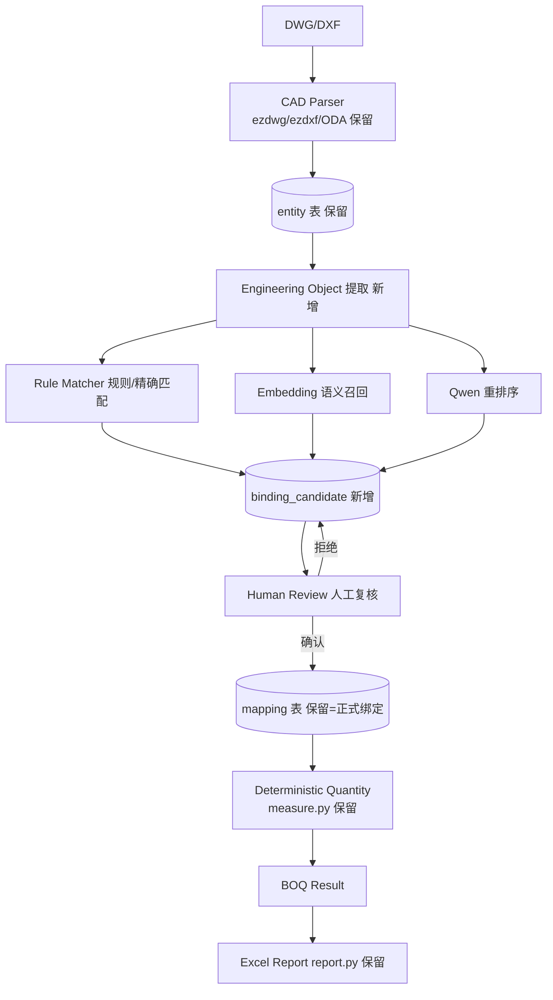

# cad-boq-tool V2 架构优化与 BOQ 智能绑定改造方案

| 项目 | 内容 |
|---|---|
| 文档版本 | v0.9（评审稿，2026-08-24） |
| 性质 | 代码审查结论 + 架构调整方案 + 分阶段执行计划（**尚未修改任何代码**） |
| 依据 | 源码逐模块审查（本轮 + 上轮 Explore 盘点） |
| 对应任务 | 用户《cad-boq-tool V2 架构优化与 BOQ 智能绑定改造任务》三十四~三十五条要求 |

---

## 0. 审查结论总览

```text
DWG/DXF → CAD Parser（保留） → Entity 库（保留）
    → Engineering Object（新增） → Candidate Generator（新增，三层：规则/Embedding/LLM）
    → Binding Candidate（新增表） → Human Review（复用+扩展 UI） → mapping（现有表，唯一正式绑定）
    → Deterministic Quantity（保留 measure） → BOQ → Excel（保留 report）
```

**核心判断**：现有 3300 行代码的复用率约 **85%**。V2 不是重构，而是"在稳定底座上长出新模块"——CAD 解析、计量、映射、BOQ、报表、规则分类、LLM 后端抽象全部保留；新增 `engineering / binding / llm` 三个模块 + 三张新表，把"AI 直接产出 BOQ 条目"改造成"AI 只产出候选绑定，人工/确定性规则确认后才写入正式 mapping"。

---

## 1. 本次架构调整说明

### 1.1 核心范式转变

| | V1（现状） | V2（目标） |
|---|---|---|
| 数据流 | DWG → 实体 → **LLM 直接输出 BOQ 条目** | DWG → 实体 → 工程对象 → 候选 BOQ → LLM 绑定建议 → 人工确认 → 正式绑定 → 确定性计量 |
| LLM 角色 | 分类 + 算数值 | **只做语义识别与 BOQ 绑定推荐**，不参与数值计算 |
| 写入正式表 | AI 结果可直接落库 | **AI 只能写 binding_candidate（PENDING）**；mapping 仅由人工确认或确定性规则写入 |
| 知识沉淀 | block_legend 一表三用（分类+绑定+计量） | Legend（是什么）/ Binding（绑哪个 BOQ）/ Measurement Rule（怎么算）**语义分离** |
| 可追溯 | 仅 source_layer/block 字符串 | BOQ → binding_candidate(含 llm_run_id) → engineering_object → entity.handle → sheet → dwg，可反查并定位高亮 |
| 离线可用 | Ollama 不可用则跳过 LLM（规则仍可用） | 明确两级模式：**模式A=AI绑定（需 LLM 可选）/ 模式B=规则算量（纯离线）**，两者都完整可用 |

### 1.2 两种运行模式（模式A / 模式B）

```text
模式A（AI 绑定模式，主要）：
  识别 CAD 对象 → 规则/Embedding/LLM 推荐候选 BOQ → 人工审核 → 确认 → 正式绑定 → 计量
模式B（规则算量模式，最终正式产出，可完全离线）：
  已确认 mapping → 确定性计量 → BOQ → Excel
```

现有 `takeoff_pipeline` 与 `run_folder_pipeline` 保留，定位为模式B 的"规则+LLM 草稿生成器"；新增 binding 管线为模式A。

### 1.3 数据流全景（对应任务第三章目标图）



---

## 2. 哪些现有模块保留（不动或仅小改）

| 模块 | 保留理由 | V2 中的角色 |
|---|---|---|
| `app/cad/reader.py` | ezdwg/ezdxf 后端桥接已稳定，DWG 直读 6024 实体 47s | 解析入口，不动 |
| `app/cad/cad_parser.py` | 10 种几何类型处理 + ParsedDrawing，工程对象提取的数据源 | 不动 |
| `app/cad/dwg.py` | ODA fallback 已修复（ezdwg 优先） | 不动 |
| `app/cad/geometry.py` | 长度/面积纯函数库 | 不动 |
| `app/db.py`（6 张现有表 CRUD） | project/sheet/entity/boq_item/mapping/block_legend | **加外键/级联/新表**，CRUD 保留 |
| `app/models.py` | 6 个 dataclass | 保留，新增 3 个 dataclass |
| `app/measure.py` | 确定性计量引擎（factor=项目×图纸×条目） | **模式B 核心**，不动 |
| `app/mapping.py` | 三种映射模式写入层 | **正式绑定唯一写入入口**，不动 |
| `app/boq/boq_parser.py` | 表头探测 + BoqItem[] | 不动 |
| `app/report.py` | 差值红绿着色 Excel | 不动 |
| `app/takeoff/classify.py` | LAYER_RULES/BLOCK_RULES 启发式 | **rule_matcher 的种子规则库**，扩展 |
| `app/takeoff/llm_backends.py` | LLMBackend 抽象 + 5 后端 | 保留，扩展 embedding 能力 |
| `app/takeoff/aggregate.py` / `stream_aggregate.py` / `quality.py` / `context_infer.py` / `folder_pipeline.py` | 模式B 文件夹流水线 | 保留 |
| `app/ui/canvas.py` / `layer_tree.py` / `boq_table.py` / `mapping_panel.py` / `ai_results_dialog.py` | 画布/定位/映射展示/置信度着色 | **Binding Workbench 的积木** |

---

## 3. 哪些模块扩展（小改，不重写）

| 模块 | 扩展点 |
|---|---|
| `app/takeoff/block_legend.py` | **语义收窄**：继续承担"块是什么"（category/device_type/spec/unit/count_rule）。新增配套函数 `get_confirmed_bindings(project_id)` 把"已确认块→BOQ"的绑定读取从 legend 中拆出（数据在 mapping/新表，函数新增不删旧）。`apply_suggestions` 与 `parse_suggestions` 保留。 |
| `app/takeoff/llm_classify.py` | `parse_json_robust` **保留为最后兜底**；新增 `app/llm/schema.py` 做 JSON Schema + Pydantic + 业务校验，优先于旧解析。 |
| `app/takeoff/orchestrator.py` | 保留模式B 六阶段；新增 `binding` 管线的编排函数（或在 binding 模块内自编排，orchestrator 不动）。倾向后者：**orchestrator 一行不改**，binding 自成一派。 |
| `app/takeoff/classify.py` | LAYER_RULES 增加 ELV/CCTV/FA 等电气弱电规则（当前弱电关键词偏少）。 |
| `app/ui/main_window.py` | 新增 Binding Workbench 标签页/入口，复用现有 4 个 worker 模式新增 `_BindingWorker`（或复用 `_AiTakeoffWorker` 回调形态）。 |
| `app/config.py` | 新增 `MODEL_PROVIDER/MODEL_NAME/EMBEDDING_MODEL/TEMPERATURE/TIMEOUT/MAX_TOKENS` 等 LLM 配置项（模型名从业务逻辑抽离）。 |

---

## 4. 新增哪些模块

按任务第三十一节建议目录落地，新增三个包 + 三个模块：

```text
app/
├── engineering/            # 新增
│   ├── __init__.py
│   ├── object_model.py     # EngineeringObject dataclass
│   ├── extractor.py        # entity 聚合 → 工程对象（设备/线性/面积三类）
│   ├── classifier.py       # discipline/system/object_type 推断（复用 classify.py 规则）
│   └── specification.py    # 规格提取（复用 aggregate.extract_typical_sizes）
├── binding/                # 新增
│   ├── __init__.py
│   ├── candidate.py        # BindingCandidate dataclass + 状态机（PENDING/ACCEPTED/REJECTED/SUPERSEDED）
│   ├── matcher.py          # 匹配编排：确认绑定优先 → 规则 → Embedding → LLM
│   ├── rule_matcher.py     # 规则/精确匹配（复用 classify + block_legend + 历史确认）
│   ├── embedding_matcher.py# EmbeddingProvider 召回 Top-N
│   ├── llm_matcher.py      # Qwen 重排序（只接收 CAD对象+附近文本+Top-N 候选）
│   ├── reviewer.py         # 人工确认/拒绝 → 写 mapping（唯一 AI→正式 通道的守护）
│   └── resolver.py         # 正式绑定 → 计量重算 + 溯源查询
├── llm/                    # 新增
│   ├── __init__.py
│   ├── schema.py           # JSON Schema + Pydantic 模型（BindingSuggestion）
│   ├── prompts.py          # 绑定推荐 Prompt（与图例 Prompt 分离）
│   ├── runner.py           # 统一调用 + JSON Schema 校验 + 失败自动重试
│   ├── audit.py            # llm_run 审计记录（每次调用一行）
│   └── embeddings.py       # EmbeddingProvider（Ollama 优先，预留接口）
└── takeoff/                # 全部保留
```

### 4.1 engineering/object_model.py —— EngineeringObject

对应任务第五章字段：

```python
@dataclass
class EngineeringObject:
    id: int
    project_id: int
    sheet_id: int
    # 溯源锚点
    entity_ids: list[int]          # 组成该对象的实体（可空，block 对象为所有同块 INSERT）
    block_name: str = ""           # INSERT 块名（设备类对象）
    layer_name: str = ""           # 图层名（线性/面积类对象）
    # 语义字段（LLM/规则可填）
    object_type: str = ""          # equipment / linear / area
    discipline: str = ""           # ELV / LV / FIRE / HVAC / PLUMBING ...
    system: str = ""               # CCTV / LIGHTING / FA ...
    tag: str = ""                  # 图元近旁 TEXT 抽取的标签（如 "CAM-01"）
    specification: str = ""        # 4MP Dome Camera / DN100 ...
    material: str = ""             # CU / PVC ...
    unit: str = ""                 # No. / m / m²
    quantity_rule: str = "count"   # count / length / area（确定性计量用）
    confidence: float = 0.0        # 提取/分类置信度
    source: str = ""               # rule / llm / manual
    created_at: str = ""
    updated_at: str = ""
```

**提取策略（第一版只做三类，对应任务二十七）**：

| 类型 | 提取来源 | 粒度 | quantity_rule |
|---|---|---|---|
| 设备（equipment） | `entity` 表 `dxf_type=INSERT` 且非 `*U` 匿名块，按 block_name 聚合 | 一对象=一块名（跨 sheet 可合并） | count |
| 线性（linear） | 图层上 LINE/POLYLINE/ARC/SPLINE 实体 | 一层=一对象（如 P-FIRE-DN100） | length |
| 面积（area） | 图层上闭合 LWPOLYLINE/HATCH | 一层=一对象（如 DUCT、ROOM） | area |

### 4.2 binding/candidate.py —— BindingCandidate 状态机

对应任务第六/七章：

```python
@dataclass
class BindingCandidate:
    id: int
    project_id: int
    engineering_object_id: int
    boq_item_id: int
    method: str                 # RULE / EMBEDDING / LLM / MANUAL
    score: float = 0.0
    confidence: float = 0.0
    reason: str = ""
    model: str = ""             # 生成该候选的模型（LLM 时）
    model_version: str = ""
    prompt_version: str = ""
    llm_run_id: int | None = None   # 关联 llm_run 审计行
    status: str = "PENDING"     # PENDING / ACCEPTED / REJECTED / SUPERSEDED
    created_at: str = ""
```

**状态机**：

```text
PENDING ──人工确认──→ ACCEPTED ──resolver──→ 写入 mapping（正式绑定）
    │
    ├──人工拒绝──→ REJECTED（记录原因，下次不推荐同 boq_item）
    └──新候选生成──→ SUPERSEDED（旧候选自动失效）
```

**写入规则（硬约束）**：
- `binding/reviewer.py` 是**唯一**能把 candidate 转成 mapping 的通道（人工点确认，或 `method=RULE` 且 score≥阈值的确定性规则自动通过——两者都必须显式调用）。
- `app/mapping.py` 的 `add_*_mapping` 保持原样，但 UI 层不再直接暴露给 AI 结果批量写入；AI 结果面板的"接受"动作改为"生成候选→进审核队列"。

### 4.3 llm/schema.py —— JSON Schema + Pydantic

对应任务十三。以 Qwen 绑定推荐输出为例：

```json
{
  "selected_boq_id": "ELV-CCTV-001",
  "confidence": 0.96,
  "reason": "...",
  "alternative_boq_ids": ["ELV-CCTV-002"],
  "needs_review": true
}
```

Pydantic 模型：

```python
class BindingSuggestion(BaseModel):
    selected_boq_id: str                      # 必须存在且属于候选集
    confidence: float = Field(ge=0.0, le=1.0) # 0~1
    reason: str = ""
    alternative_boq_ids: list[str] = []
    needs_review: bool = True

    @field_validator("selected_boq_id")
    @classmethod
    def _must_be_in_candidates(cls, v, info):
        allowed = info.context.get("allowed_boq_ids", [])
        if allowed and v not in allowed:
            raise ValueError(f"selected_boq_id={v} 不在候选集内")
        return v
```

流程：`LLM → JSON Schema(jsonschema 校验) → Pydantic(类型/范围/业务) → BindingCandidate`；校验失败按 runner 策略自动重试（最多 2 次，换温度/截断提示）。`llm_classify.parse_json_robust` 保留为**兜底**，但新管线不再依赖它做主要校验。

### 4.4 llm/audit.py —— llm_run 审计

对应任务二十一。每次 LLM 调用落一行：

```text
llm_run(id, project_id, task_type, model, model_version, prompt_version,
        temperature, input_hash, output_hash, duration_ms,
        token_input, token_output, status, error, created_at)
```

`input_hash = sha256(prompt)`、`output_hash = sha256(content)`。binding_candidate.llm_run_id 外键关联，可回答"这条绑定是哪个模型/哪版 Prompt/什么时候生成的"。

### 4.5 llm/embeddings.py —— EmbeddingProvider

对应任务十一：

```python
class EmbeddingProvider(ABC):
    @abstractmethod
    def embed(self, texts: list[str]) -> list[list[float]]: ...
    @abstractmethod
    def is_available(self) -> bool: ...

class OllamaEmbeddingProvider(EmbeddingProvider):
    def __init__(self, model="nomic-embed-text", host="http://127.0.0.1:11434"): ...
```

- 语义召回：EO 侧拼接 `block_name + layer_name + tag + specification + object_type`；BOQ 侧拼接 `code + description + unit`；余弦相似度取 Top-5。
- Ollama 未装时 `is_available()=False` → 自动跳过该层（模式B/离线不受影响）。
- 预留 DashScope/BGE 等 provider 扩展位（工厂函数）。

### 4.6 binding/matcher.py —— 优先级链

对应任务十五：

```text
① 项目级人工确认绑定（mapping + block_legend 已确认）── 最高，直接采用
② 项目级规则（block_legend + 用户手动绑定沉淀的规则）
③ 全局规则（classify.py + rule_matcher 内置规则表）
④ Embedding 语义召回 Top-5
⑤ Qwen 重排序（在 ④ 的 Top-N 内选）＋ 规则候选
⑥ 通用启发式（兜底）
```

### 4.7 解析缓存（性能，任务二十四）

```text
cache/
  <sha256(path+mtime+size+parser_version)>/
    entities.parquet      # 实体（几何已序列化）
    blocks.json           # block_refs / blocks_with_count
    metadata.json         # 解析耗时/版本/图层数等
```

- `app/cad/parse_cache.py`（新增）：`cache_key(path) -> str|None`、`load_cache(key) -> ParsedDrawing|None`、`store_cache(key, drawing)`。
- 目标：**同一 DWG 二次打开从 47s → <1s**；39 张图首次全量仍约 30 分钟（可后台逐张预热），后续秒开。
- 图纸级并行（Process Pool）作为 Phase 6 后置项，不在第一版做。

---

## 5. 数据库新增字段/表

### 5.1 现有表变更（最小化）

| 变更 | 说明 |
|---|---|
| 连接层 | `get_conn()` 增加 `PRAGMA foreign_keys = ON`（每个连接） |
| 建表语句 | 6 张现有表**不删不改列**；新库建表带 `FOREIGN KEY ... ON DELETE CASCADE` |
| 迁移 `_migrate` | 对旧库：补齐外键需重建表，**降级方案**——不重建，改由 `delete_project` 手工级联删除（修复孤儿数据 bug），外键仅对新库生效 |
| `delete_project` | 修复：级联删除 `sheet → entity → mapping → block_legend → binding_candidate → engineering_object → llm_run(该项目) ` |
| 新索引 | `(entity.sheet_id, entity.layer)`、`(entity.sheet_id, entity.block_name)` 已存在；补 `(mapping.boq_item_id)` 已存在；新增 `(binding_candidate.engineering_object_id)`、`(binding_candidate.boq_item_id)`、`(binding_candidate.status)` |

### 5.2 新增 3 张表

```sql
-- 工程对象（任务五）
CREATE TABLE IF NOT EXISTS engineering_object (
    id INTEGER PRIMARY KEY AUTOINCREMENT,
    project_id INTEGER NOT NULL REFERENCES project(id) ON DELETE CASCADE,
    sheet_id INTEGER REFERENCES sheet(id) ON DELETE CASCADE,
    object_type TEXT DEFAULT '',            -- equipment / linear / area
    discipline TEXT DEFAULT '',
    system TEXT DEFAULT '',
    subsystem TEXT DEFAULT '',
    block_name TEXT DEFAULT '',
    layer_name TEXT DEFAULT '',
    tag TEXT DEFAULT '',
    specification TEXT DEFAULT '',
    material TEXT DEFAULT '',
    unit TEXT DEFAULT '',
    quantity_rule TEXT DEFAULT 'count',     -- count / length / area
    confidence REAL DEFAULT 0,
    source TEXT DEFAULT '',
    entity_ids TEXT DEFAULT '',             -- JSON [entity_id,...] 溯源锚点
    created_at TEXT DEFAULT '',
    updated_at TEXT DEFAULT ''
);
CREATE INDEX IF NOT EXISTS idx_eo_project ON engineering_object(project_id);
CREATE INDEX IF NOT EXISTS idx_eo_block ON engineering_object(project_id, block_name);
CREATE INDEX IF NOT EXISTS idx_eo_layer ON engineering_object(project_id, layer_name);

-- 绑定候选（任务六）
CREATE TABLE IF NOT EXISTS binding_candidate (
    id INTEGER PRIMARY KEY AUTOINCREMENT,
    project_id INTEGER NOT NULL REFERENCES project(id) ON DELETE CASCADE,
    engineering_object_id INTEGER NOT NULL REFERENCES engineering_object(id) ON DELETE CASCADE,
    boq_item_id INTEGER NOT NULL REFERENCES boq_item(id) ON DELETE CASCADE,
    method TEXT DEFAULT 'LLM',              -- RULE / EMBEDDING / LLM / MANUAL
    score REAL DEFAULT 0,
    confidence REAL DEFAULT 0,
    reason TEXT DEFAULT '',
    model TEXT DEFAULT '',
    model_version TEXT DEFAULT '',
    prompt_version TEXT DEFAULT '',
    llm_run_id INTEGER REFERENCES llm_run(id) ON DELETE SET NULL,
    status TEXT DEFAULT 'PENDING',          -- PENDING / ACCEPTED / REJECTED / SUPERSEDED
    created_at TEXT DEFAULT ''
);
CREATE INDEX IF NOT EXISTS idx_bc_eo ON binding_candidate(engineering_object_id);
CREATE INDEX IF NOT EXISTS idx_bc_boq ON binding_candidate(boq_item_id);
CREATE INDEX IF NOT EXISTS idx_bc_status ON binding_candidate(project_id, status);

-- LLM 审计（任务二十一）
CREATE TABLE IF NOT EXISTS llm_run (
    id INTEGER PRIMARY KEY AUTOINCREMENT,
    project_id INTEGER REFERENCES project(id) ON DELETE CASCADE,
    task_type TEXT DEFAULT '',              -- legend / binding / classify / embedding
    model TEXT DEFAULT '',
    model_version TEXT DEFAULT '',
    prompt_version TEXT DEFAULT '',
    temperature REAL DEFAULT 0,
    input_hash TEXT DEFAULT '',
    output_hash TEXT DEFAULT '',
    duration_ms INTEGER DEFAULT 0,
    token_input INTEGER DEFAULT 0,
    token_output INTEGER DEFAULT 0,
    status TEXT DEFAULT 'ok',               -- ok / error / retried
    error TEXT DEFAULT '',
    created_at TEXT DEFAULT ''
);
```

### 5.3 不引入空间数据库

第一阶段 SQLite 足够（任务二十-4）。`entity.bbox` 保持 JSON 文本，仅对 `engineering_object` 提供 `entity_ids` 溯源索引。

---

## 6. CAD Object → BOQ Binding 完整流程（端到端）

```text
① 解析：DWG →（缓存命中?）→ entity 入库
② 提取：entity → EngineeringObject（设备/线性/面积三类）
③ 候选召回：
     a. 项目级已确认绑定（mapping/legend）→ 直接命中，跳过 AI
     b. rule_matcher 规则/精确匹配 → 命中且置信度高 → 直接生成候选（RULE）
     c. embedding_matcher Top-5 召回 → 生成候选（EMBEDDING）
     d. llm_matcher 在 Top-N 内重排序 → 生成候选（LLM）
④ 写入 binding_candidate（PENDING，带 llm_run_id/reason/score）
⑤ 人工复核（Binding Workbench）→ ACCEPTED / REJECTED / 手动改选
⑥ resolver：ACCEPTED → 写 mapping（entity/layer/block 模式）→ 触发 measure 重算
⑦ 计量：measure.compute_item（确定性，Python 计算）
⑧ 报表：report.export_report（溯源列：sheet/图层/块/实体数）
```

**溯源反查**（任务十九）：`BOQ Item → mapping → engineering_object.entity_ids → entity.handle → sheet.src_path → 画布定位高亮`。

---

## 7. Manual Binding 流程（模式B 核心，LLM 关闭也必须可用）

```text
① 画布选择实体 / 图层树选图层 / 图例面板选块
② 右侧 BOQ 表格选中目标条目
③ 「绑定」→ mapping 写入（现有 mapping_panel 逻辑，保留）
④ 自动重算：measure.compute_item → mapping_panel.result_label 显示数量
⑤ 沉淀规则：MANUAL 绑定同时写 block_legend（device_type/spec/unit/count_rule）
   与 project_rule（新函数 get/set_project_binding：block_name→boq_item_id）
⑥ 导出 Excel
```

验收：**不启动 Ollama、拔掉网络，以上 1-6 全程可用**（对应测试 J）。

---

## 8. Rule Matching 流程

```text
输入：EngineeringObject（block_name/layer_name/spec）
规则源（按优先级）：
  1) 项目级人工确认绑定（用户手动绑过的 block_name→boq_item_id）——最强
  2) block_legend 已确认（category/device_type/unit/count_rule）
  3) classify.py LAYER_RULES/BLOCK_RULES 启发式（扩展 ELV/CCTV/FA）
  4) 内置规则表 rule_matcher.RULES（如 "CAM_* → CCTV 摄像机类 BOQ 关键词"）
匹配成功且 score ≥ 0.9 → 直接生成 RULE 候选（可自动通过，仍需人工批量确认页确认一次）
匹配成功但 score < 0.9 → 生成候选进审核队列
无匹配 → 交给 Embedding/LLM
```

**候选过滤**（任务十）：如 `layer=ELV-CCTV` → 先按 discipline=ELV, system=CCTV 过滤 BOQ；`block=CAM_DOME` → 再按 object_type=camera 过滤；5000 条 BOQ → ~8 条候选，再交给 AI。过滤规则在 `binding/rule_matcher.py` 实现，复用 `classify.py` 的分类结果做 `discipline/system/object_type` 映射。

---

## 9. Embedding Matching 流程（任务十一）

```text
① OllamaEmbeddingProvider 可用性探测（Ollama 未装→跳过，不影响主流程）
② EO 文本：CAM_DOME | ELV-CCTV | Dome Camera | 4MP | object_type=camera
③ BOQ 文本：IP Camera | 4MP Dome Camera | PoE | Indoor（code+description+unit 拼接）
④ embed() 批量向量化 → 余弦相似度矩阵
⑤ Top-5 候选 → 写 binding_candidate(method=EMBEDDING, score=相似度)
⑥ Top-5 一并交给 llm_matcher 重排序
```

首次 V2 版本**不建向量库**（不引入 chromadb/faiss），BOQ 条目数（≤5000）直接内存余弦计算即可。

---

## 10. Qwen Matching 流程（任务十二、十三、二十二）

```text
输入（严格裁剪，绝不给整张 DWG）：
  CAD Object：block/layer/tag/spec/nearby text（≤2 句）
  候选集：Top-N（规则+Embedding 召回，≤8 条）的 code/description/unit
输出：严格 JSON（llm/schema.py 定义）
Prompt 版本：prompts.py 统一管理（prompt_version 记录在 llm_run）
校验链：JSON Schema → Pydantic → 业务校验（selected_boq_id ∈ 候选集）→ 失败自动重试（≤2 次）
成功 → binding_candidate(method=LLM, llm_run_id=...)
```

模型配置抽离（任务二十二）：`config.py` 增加 `MODEL_PROVIDER/MODEL_NAME/EMBEDDING_MODEL/TEMPERATURE/TIMEOUT/MAX_TOKENS`，默认 `ollama/qwen2.5:7b`，可切 `qwen3` 或其他本地模型，不改业务代码。

---

## 11. Human Review 流程（任务十四）

**Binding Workbench**（任务二十六，复用现有组件组合，不重做 UI）：

```text
┌──────────────┬─────────────────┬──────────────────┐
│ CAD Objects   │  CAD Canvas      │  BOQ Candidates  │
│ (新增列表)    │ (现有 canvas)    │ (现有 boq_table) │
├──────────────┴─────────────────┴──────────────────┤
│  审核队列：                                          │
│  CAD对象: CAM_DOME / ELV-CCTV / 4MP                │
│  AI推荐: BOQ-001 4MP Dome Camera  [确认] [选择其他] │
│          候选: BOQ-002 8MP Dome 92%                │
│                BOQ-003 4MP Bullet 63%              │
│  [拒绝并记录原因] [查看来源→定位高亮]                │
└────────────────────────────────────────────────────┘
```

- 复用：`canvas`（定位高亮，`_do_flash` 已修）、`boq_table`（候选展示）、`ai_results_dialog`（置信度着色/冲突）、`legend_panel`（图例编辑）。
- 新增：`binding_workbench.py`（编排上述组件 + 审核队列表格 + 确认/拒绝按钮 + 来源追溯按钮）。
- 确认动作 → `reviewer.confirm(candidate_id)` → 写 mapping → 重算 → 状态 ACCEPTED。
- 拒绝动作 → `reviewer.reject(candidate_id, reason)` → 状态 REJECTED，matcher 后续跳过该组合。

---

## 12. Quantity 计算流程（任务十七、十八）

```text
Confirmed Mapping（entity/layer/block）
    ↓ measure.compute_item（factor = 项目×图纸×条目，面积因子平方）
    ↓ 确定性 Python 计算：
        count  → len(实体)         （Block/Entity 数量）
        length → Σ entity.length   （Line/Polyline/Arc/Spline）
        area   → Σ entity.area     （闭合 Polyline/Hatch）
    ↓ BOQ Result（LLM 永不参与数值）
```

`engineering_object.quantity_rule` 提供语义建议，但**最终计量以 mapping 对应 boq_item.rule_type + measure 为准**，二者不一致时以人工/规则设置的 boq_item 为准并提示。

---

## 13. BOQ 溯源流程（任务十九）

```text
BOQ Item (boq_item_id)
  → mapping（layer/block/entity 模式）
  → engineering_object.entity_ids → entity(handle, bbox, sheet_id)
  → sheet(src_path, filename, scale)
  → 画布：switch sheet → 构建高亮实体集合 → flash_entities（现有能力）
  → 弹窗显示：DWG 文件、图层、块、实体 handle 列表、坐标 bbox
```

UI 入口：mapping_panel / binding workbench 每条绑定加「查看来源」按钮。

---

## 14. 新增测试

`test_binding.py`（对应任务二十八 A–J）：

| 用例 | 内容 | 关联模块 |
|---|---|---|
| A | 手动绑定：Block → BOQ → count 计量 | mapping + measure |
| B | AI 候选：CAD Object → Top-N candidates（mock LLM） | matcher |
| C | Qwen 结构化输出：Valid JSON / Invalid JSON / Missing field / Wrong BOQ ID | schema + runner |
| D | 人工确认：candidate → mapping | reviewer |
| E | 人工拒绝：candidate → REJECTED，且不再推荐同 boq_item | reviewer + matcher |
| F | 已确认绑定不被 AI 覆盖（AI 只写 PENDING） | candidate + reviewer |
| G | 同一项目重复 Block 复用历史确认结果 | matcher 优先级① |
| H | BOQ 数量反查 CAD 来源（溯源链完整） | resolver |
| I | 删除项目不产生孤儿数据（级联删干净） | db.delete_project |
| J | LLM 关闭时 Manual Binding 全流程可用（mock 掉 ollama） | 全链路 |

测试隔离：沿用 `_test_db.py` 模式；新表全部进 schema，测试自动建到 temp 库。

---

## 15. 全部测试结果（当前基线，改造前）

| 脚本 | 现状 | V2 每阶段后必须保持 |
|---|---|---|
| test_core.py | ALL PASSED | ✅ |
| test_e2e.py | 17/17 PASS | ✅ |
| test_legend.py | PASS | ✅ |
| test_ai_takeoff.py | PASS | ✅ |
| gui_smoke.py | 9/9 PASS | ✅ |
| test_binding.py | 新增 | ✅ |
| pyflakes app/ | 0 警告 | ✅ |

---

## 16. 性能变化（现状 → 目标）

| 项 | 现状 | V2 目标 |
|---|---|---|
| 单图解析（6024 实体 DWG） | ~47s | 首次 47s；**二次打开 <1s（缓存）** |
| 39 图全量首次 | ~30 分钟（串行） | 同（可选后台预热）；二次全秒开 |
| LLM 图例标定 215 块 | ~5-8 分钟（11 批串行） | 不变（第一批不优化 LLM 并发，避免风险） |
| BOQ 候选召回 | 5000 条全量进 prompt | 规则过滤后 ≤8 条进 LLM（**token 成本降一个量级**） |
| 正式计量 | 即点即算 | 不变（确定性，快） |

---

## 17. 当前已知问题（沿用设计文档第 7 章 + 本轮新增）

1. `delete_project` 不删 sheet/entity —— **本轮修复**（级联）。
2. 无外键约束 —— **本轮新库启用 + 旧库手工级联降级**。
3. `entity.bbox/geom_json` JSON 文本无法 SQL 空间查询 —— 第一阶段接受，V2 不引入空间库。
4. LLM 串行分批、无重试/背压 —— V2 加 runner 重试（≤2 次）与 llm_run 审计；并发后置。
5. 解析器强依赖 qwen2.5 输出形态 —— V2 增加 JSON Schema + Pydantic 主校验，旧解析降级兜底。
6. ParseWorker 无取消机制 —— 后置（QFuture 阶段），本阶段不动。
7. 测试隔离靠 monkeypatch —— 维持（temp 库够用），后续可换 fixture。
8. 无日志落盘 —— 后置。
9. `count_rule=length` 按块几何计量未实现 —— V2 engineering linear 类天然覆盖（按图层长度），块内长度计量暂缓。
10. block_legend 一表三用 —— **本轮语义分离**（Legend 数据保留，Binding 走新表）。

---

## 18. 下一阶段建议

1. **先落地 Phase 1（DB）+ Phase 2（engineering）+ 模式B 手动绑定闭环** —— 满足"Manual Binding 100% 可用 + Deterministic Quantity 100% 可追溯"这一最高标准。
2. 再上 Phase 3（rule_matcher + 历史确认复用）—— 让"人工绑定沉淀为规则"闭环先跑起来（不依赖 LLM）。
3. 之后 Phase 4（LLM 三层匹配 + 审计）—— 提升自动绑定率，人工只需确认。
4. UI（Binding Workbench）与 Phase 2/3 并行开发，复用现有组件。
5. 性能缓存（Phase 6）可在任意阶段后插入，收益独立。

---

## 附：分阶段执行计划（待你确认后按序执行）

| 阶段 | 内容 | 交付 | 回归 |
|---|---|---|---|
| P0 | ✅ 已完成：代码审查 + 本方案 | 本文档 | — |
| P1 | DB：FK/cascade/新表 3 张/delete_project 修复/索引；models 新增 3 dataclass | db.py + models.py + 迁移 | test_core/test_e2e/test_legend |
| P2 | engineering：object_model/extractor/classifier/specification + 单元测试 | app/engineering/* + 测试 | 全量 |
| P3 | binding 模式B：candidate/rule_matcher/manual reviewer/resolver + 历史确认复用 | app/binding/*（不含 LLM）+ test_binding A/B/F/G/H/I/J | 全量 + test_binding |
| P4 | llm：schema/prompts/runner/audit/embeddings + llm_matcher + config 抽离 | app/llm/* + test_binding C/D/E | 全量 |
| P5 | UI：Binding Workbench + 溯源查看 | app/ui/binding_workbench.py + main_window 接线 | gui_smoke + 手动 |
| P6 | 性能：解析缓存（parquet）+（可选）图纸级并行 | app/cad/parse_cache.py | 全量 |

**每个阶段结束都跑：`test_core / test_e2e / test_legend / test_ai_takeoff / gui_smoke / test_binding + pyflakes app/`，全绿才进下一阶段。**

---

## 待你确认的关键决策（3 个）

1. **P1 外键策略**：新库启用 FK+cascade；旧库 `delete_project` 手工级联（不重建表）。是否接受？（接受则开始 P1）
2. **P3 自动通过阈值**：`method=RULE` 且 score≥0.9 的候选是否需要人工批量确认页再点一次"批量确认"，还是直接自动写入 mapping？（建议保留一次人工确认，防误绑）
3. **P4 LLM 并发**：本阶段 LLM 调用仍串行（安全），并发优化放到 P6 之后，是否接受？
