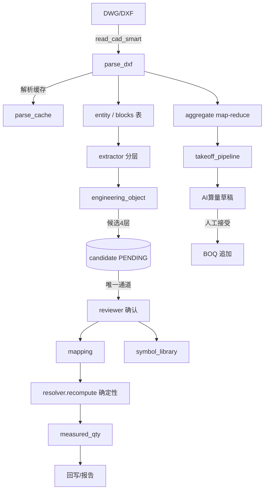

# 图纸算量系统（CAD·BOQ）技术架构与实现说明

> **版本**：v1.1（2026-08-29，LBH 实战对账版）
> **范围**：以 `d:\workbuddy work\AICAD\cad-boq-tool` 仓库 **代码事实** 为准（无假设）
> **状态图例**：【已实现】= 代码存在且链路闭环；【部分实现】= 代码存在但依赖外部前置条件；【规划中/未实现】= 仅文档/注释提及；【建议新增】= 审计提出的改进项（`S-x` 编号）
> **行号引用**：仅对本次审计逐行验证过的位置给出行号，其余给到文件级；行号对应审计当日 main 分支
>
> **v1.1 变更**：原 v1.0 的 §10 只能依据二手摘要做对账，导致 3 处判断失真（`compact()` 已覆盖欧式逗号归一却记为缺失；内容级检索记为「已满足」实为缺失；回写记为「部分支持」实为**完全不具备原文件保真回写能力**）。本版以 LBH 医院项目（4 专业 / 1797 条 / 271 份图纸 / 153 份结构图）的**一手过程明细**重写 §10，新增 §11.4 问题清单、重写 §12 路线图（P0 重排），并新增 §16 实战经验库。§1~§9、§13~§15 为代码审计结论，本次未改动。

---

## 0. 文档目标与方法

本文档通过逆向代码审计回答四个问题：

1. 系统「解析 → 工程对象 → 绑定 → 计量 → 回写」的真实数据流是什么？
2. 每个算法的输入、处理、核心公式、关键条件、输出、来源代码、已知问题。
3. AI（LLM/Embedding）与人工（审核/标定）各自承担什么职责、边界在哪里。
4. 现有准确率的瓶颈，以及 WorkBuddy 项目（LBH 医院算量）实战已验证的更准算法如何映射进来。

### 0.1 审计口径

| 标记 | 定义 |
|---|---|
| 【已实现】 | 代码存在、函数可调用、模块间链路贯通，至少被一处生产代码引用 |
| 【部分实现】 | 代码存在，但依赖前置条件（如 LLM 后端未配置 / ezdwg 未安装）导致路径常不可达 |
| 【规划中/未实现】 | 仅注释/文档提及，无代码落地 |
| 【建议】 | 审计基于代码缺口提出的改进项（`S-1` ~ `S-23`；其中 `S-12` ~ `S-23` 为 v1.1 依据 LBH 实战新增） |

### 0.2 文档结构

- §1~§8：按模块逐层审计（每模块含输入 / 处理 / 核心公式 / 关键条件 / 输出 / 已知问题）
- §9：端到端真实数据流（三条链路）
- **§10：WorkBuddy LBH 实战对账（v1.1 重写：核对率归因 / 分部级差异 / 18 条逐条对账 / 架构缺口）**
- §11：问题清单（v1.1 新增 §11.4 交付能力与可核性，C-14 ~ C-25）
- **§12：改进路线 P0/P1/P2（v1.1 按LBH证据重排，可核性闸门与交付能力升为 P0）**
- §13：术语表
- §14：代码索引表（模块 → 文件 → 函数 → 说明 → 状态）
- §15：数据流图（Mermaid）
- **§16：LBH 实战经验库（v1.1 新增：可核性阈值 / 大文件工程约束 / STATUS_MAP / BOQ 布局实测 / 检索三原则）**

> **注**：§1~§9、§13~§15 为 v1.0 代码审计结论，v1.1 未改动（仅修正 §15 编号笔误与 §14 一处失真标注）。
> v1.1 的实质增量集中在 §10、§11.4、§12、§16 —— 即「软件需要改进和提升的要点」。

---

## 1. 系统总览

### 1.1 一句话定位

PySide6 桌面端 CAD 算量工具：解析 DWG/DXF → 实体/图层/块 → 工程对象 →（AI 辅助）绑定 BOQ 清单 → 确定性计量 → Excel 报告/回写实测列。

### 1.2 技术栈

| 层 | 选型 | 位置 |
|---|---|---|
| UI | PySide6（Qt，深色主题 v3） | `app/ui/` |
| CAD 解析 | ezdwg（DWG 直读，Rust 内核）+ ezdxf（DXF）+ ODA File Converter（DWG→DXF 回退） | `app/cad/` |
| 存储 | SQLite（WAL，单文件） | `~/.cad-boq-tool/projects.db` |
| LLM | Ollama 本地 / DashScope / OpenAI / DeepSeek / 任意 OpenAI 兼容端点 | `app/llm/`、`app/takeoff/llm_backends.py` |
| Embedding | Ollama 或 OpenAI 兼容端点，内存/磁盘两级向量缓存 | `app/llm/embeddings.py` |
| 导出 | openpyxl | `app/report.py`、`app/boq/writeback.py` |

### 1.3 顶层双管线架构

```
┌──────────────────────────────────────────────────────────────────────────┐
│                        app/ui（PySide6 主窗口）                           │
│  AI 算量 ▾ ── 更多 ▾ ── 图例标定 ── 绑定工作台 ── BOQ/计量/报告            │
└───────┬──────────────────────────┬──────────────────────────────────────┘
        │                          │
        ▼                          ▼
┌─────────────────────┐   ┌─────────────────────────────┐
│ 管线A：AI 算量草稿   │   │ 管线B：AI 绑定（V2 主链路）  │
│ takeoff/            │   │ binding/ + engineering/    │
│ 解析→聚合→规则分类   │   │ 提取EO→分层候选→人工审核   │
│ →LLM命名→冲突合并   │   │ → 正式mapping→确定性计量     │
└─────────┬───────────┘   └──────────────┬──────────────┘
          │                              │
          ▼                              ▼
    BOQ 清单(追加/实测列)        mapping + boq_item.measured_qty
```

两条管线**共享同一数据栈**（`entity` / `engineering_object` / `boq_item` / `block_legend`），但候选与计量字段各自独立流转（§11 C-07）。

---

## 2. 数据模型与数据库

### 2.1 模型总览（app/models.py）

| 模型 | 关键字段 | 用途 |
|---|---|---|
| Project | name / boq_path | 项目 |
| Sheet | src_path / dxf_path / scale / blocks_json / is_base | 图纸（比例、块几何缓存、是否底图） |
| Entity | handle / layer / block_name / bbox / geom_json / length / area | 解析实体（id 跨会话稳定） |
| BoqItem | code / desc / unit / original_qty / rule_type / scale_factor / **measured_qty** | BOQ 条目（后补实测数量列，原数量列不覆盖） |
| Mapping | mode：entity / layer / block | 实体 ↔ BOQ 正式映射 |
| EngineeringObject | object_type / discipline / system / block_name / layer / spec / quantity_rule / confidence / source / entity_ids | V2 管线核心对象 |
| BindingCandidate | method / score / confidence / status | AI/规则产出，PENDING 待人工审 |
| LlmRun | task_type / model / prompt_version / **input_text / output_text 全文** | LLM 审计（全量落库） |
| symbol_library | key=(project,block,layer) 唯一 | 人工标定知识库 |
| block_legend | (project,block_name) 唯一，confirmed | 图例标定（算量口径） |
| project_config | layer_rules / block_rules / meta | 项目级规则（图层四桶） |

### 2.2 数据库实现要点（app/db.py）

- SQLite **WAL + 256MB 页缓存 + mmap**；`busy_timeout 5000`；
- **单写者模型**：批量重解析时 worker 只写 parse_cache，主进程串行入库（batch_reparse.py），避免 SQLite 写锁竞争；
- **stale `-shm` 自愈**：残留 WAL/SHM 文件时自动以 DELETE 模式回退重建，防启动失败；
- **索引**：`idx_entity_block` / `idx_entity_layer` / `idx_eo_block` / `idx_bc_*` 支撑高频查询；
- **碎片治理**：`db_usage()` + `vacuum_database()` 入口（实测 1.6GB → 170MB）。

---

## 3. CAD 解析层（app/cad/）

### 3.1 后端选择（reader.py）

```
输入: 文件路径（.dwg / .dxf）
  │
  ▼
ezdwg 直读（DWG 优先，支持 R14–R2018）── 成功 ──► 直接解析
  └─ 失败 ─► ODA File Converter 转 DXF ──► ezdxf 解析
```

- 统一包装：ezdxf 与 ezdwg 两个后端经 `_DxfProxy` / `_EntityWrapper` / `_DocWrapper` / `_MspWrapper` 桥接，业务代码无感知；
- **图层乱码修复**：ezdwg 读非 UTF-8 编码 DWG 时 layer 名出现乱码 CJK → 启发式检测（CJK 区块判断）+ 归一为稳定 key（`__garbled_<sha1前8>__`）；
- **Rust panic 规避**：`_DocWrapper` 预建 layer_handle→name 缓存，避免迭代中反复 `graph()` 调用；
- `probe_dwg_support()` 秒级探测（读文件头 + 轻量 graph），批量流程先分流。

### 3.2 实体几何提取（cad_parser.py）

**输入**：单个 CAD 实体
**处理**：按 dxf_type 分支（`_entity_geom`），单实体异常跳过不中断

| 类型 | 长度/面积公式 | 备注 |
|---|---|---|
| LINE | ‖start − end‖ | |
| LWPOLYLINE / POLYLINE | 逐段 bulge→弧长（`bulge_to_arc_length`）；闭合时 shoelace 面积 | |
| ARC | r × Δθ | |
| CIRCLE | 2πr / πr² | |
| SPLINE | 控制点多边形近似（**非真实弧长**） | §3.5 P-01 |
| ELLIPSE | Ramanujan 近似周长 π(3(a+b) − √((3a+b)(a+3b))) | |
| HATCH | 第一个外环 shoelace | §3.5 P-03 |
| INSERT | 记录 block/insert/attribs/scale/rotation，嵌套展开 | |

**关键条件**：
- `GEOMETRIC_TYPES` 白名单过滤；
- 嵌套块递归展开 `_collect_block_geometry`：深度 ≤ 8、环检测；（cad_parser.py）
- 颜色：true_color > layer.rgb 缓存 > ACI 调色板 > 白。

**输出**：`ParsedDrawing{entities, layers, layer_colors, blocks, blocks_with_count}`，实体带 `geom_json` + `length` + `area` + `bbox`。

### 3.3 解析缓存（parse_cache.py）

```
cache_key = sha256(abs_path | mtime_ns | size | PARSER_VERSION)
PARSER_VERSION = "v2"（含嵌套 INSERT 递归解析）
```

存储：`~/.cad-boq-tool/drawing_cache/<key>/entities.parquet（pyarrow，不可用则 JSON）+ blocks.json + metadata.json`。命中后二次打开 ~47s → <1s。容量上限 `PARSE_CACHE_MAX_ENTRIES=100`（config.py 可配、按 mtime 淘汰）。

### 3.4 DWG→DXF 回退（dwg.py）

- 封装 ODAFileConverter CLI：`<in_dir> <out_dir> ACAD2018 DXF 1`；单文件先复制到独立工作目录避免目录内其他文件被连带转换；
- `convert_dwgs_batch`：按文件大小贪心分组成并行组（同 stem 避开同组防覆盖），每组一次 ODA 启动，返回 `{src: dxf}` 映射。

### 3.5 已知问题（解析层）

| 编号 | 问题 | 影响 |
|---|---|---|
| P-01 | SPLINE 长度=控制多边形近似，非真实弧长 | 样条导线长度偏小（WorkBuddy 用 `approximate(64)` 修复，见 §10 #7） |
| P-02 | 非均匀缩放 INSERT 内 CIRCLE 用平均缩放近似半径 | 块展开几何精度损失 |
| P-03 | HATCH 只取第一个外环 | 嵌套边界面积不全 |
| P-04 | TEXT/MTEXT 截断 200 字符 | 长规格文本丢失 |
| P-05 | ezdwg 失败→ODA 产物仅临时目录不落盘 | 重复解析成本 |

---

## 4. 工程对象提取（app/engineering/）

### 4.1 分层语义提取（extractor.py）

```
实体/图层/块 → ① 规则推断 → ② 知识库 symbol_library → ③ LLM 分类（置信度 <0.5 时触发）
```

- 规则层：`infer_object_meta`（block/layer 名 → discipline / system / equipment_type / category）
- 知识库层：命中覆盖语义，`conf = max(原 conf, 0.9 人工标定 / 0.95 图例 confirmed)`
- 置信度策略：
  - 规则命中且 category 非空 → 0.8；未命中 → 0.4（**留出 LLM 触发空间**）
  - 含块属性（ATTRIB）→ ≥0.85；知识库命中 → 0.9；图例 confirmed → 0.95

### 4.2 图层四桶规则

| 桶 | 处理 | 位置 |
|---|---|---|
| equipment | INSERT 块（匿名 `*` 前缀跳过） | extractor.py |
| linear | LWPOLYLINE/LINE/ARC/SPLINE，推断长度 | extractor.py |
| area | HATCH / 闭合多段线 | extractor.py |
| skip | 建筑背景（BUILDING_BG_KEYWORDS）/ 空层 / 未归类 | extractor.py |

- 规则来源：`project_config.layer_rules`（用户可在「项目设置」配 4 桶）→ 未配置时退化到全局 `BUILDING_BG_KEYWORDS` 白名单过滤。

### 4.3 规格推断（specification.py）

- 块属性优先：`MODEL/TYPE/SPEC/SIZE/DN/POWER/型号/规格/口径/功率` tag → 取首个非空；否则拼接全部非空 value（去重、截断 200 字符）；
- 块名正则：`\d{1,4}\s*MP` / `\d{2,4}mm` / `\d{3,4}x\d{3,4}` / `\d{2,4}W`；
- 图层名：复用 `extract_typical_sizes`（导线层即电缆型号实证）。

### 4.4 溯源

`get_object_trace(eoid)` → EO → entity_ids（≤2000 直接锚点）→ entity handle/bbox → 图纸。

---

## 5. BOQ 解析（app/boq/boq_parser.py）

| 步骤 | 实现 |
|---|---|
| 表头探测 | 前 5 行内 `BOQ_HEADER_CANDIDATES`（code/描述/unit/qty 中英候选） |
| 合同段落过滤 | 长度≥100 且含条款词（Contractor / Rates 等）→ 跳过 |
| 列错位自愈 | desc 短 + unit 含大写型号（4+ 字母数字）→ 交换 |
| 数量解析 | `float(str.replace(",", ""))` |

- `parse_boq` 返回 `(BoqItem[], 表头映射)`；无表头时按 code/desc/unit 0/1/2 列假定。
- `reparse_boq`（「修复 BOQ」）：删除表头码行/章节标题行/纯长英文 code + 列换位修复。

---

## 6. AI 算量管线（app/takeoff/）

### 6.1 主入口 `takeoff_pipeline`（orchestrator.py:113）

```
阶段1 解析        parse_cache → parse_dxf
阶段2 聚合        aggregate() → AggregatedDrawing
阶段3 规则分类    layer 置信度≥0.7 → 规则条目；块 → 图例优先(_block_takeoff_item)
阶段4 LLM 分类    build_prompt（注入图例确认段）→ llm_classify_openai → 结构化 items
阶段5 冲突合并    (code, unit) 去重：LLM 优先，规则补漏
阶段6 导出        TakeoffItem[] → 人工确认 → 追加 BOQ（不覆盖）
```

- **数值来自聚合层**：LLM 只做命名/归类；SYSTEM_PROMPT 硬性指令「数值必须直接采用输入的汇总值」（llm_classify.py:15）；
- **图例优先**：EO 的块引用若在 `block_legend` 已确认 → `_block_takeoff_item`（置信度 0.95）直接生成，块名不再发 LLM；未确认 → `classify_block` 规则兜底；仍无 → LLM；
- 输出 `TakeoffItem{code, desc, unit, qty, source_layer, confidence}`，source ∈ rule/legend/llm 可追踪。

### 6.2 聚合（aggregate.py）

- 分块 map-reduce：`chunk_size=20000`，`_map_chunk` 单遍累加、`_merge_accumulators` 合并（免全表二次扫描）；
- 50m×50m 网格分区 `RegionSummary`：实体 bbox 中心点分格，区域累计长度/面积 + 块引用；
- 规格抽取 `extract_typical_sizes`（aggregate.py:89）——9 个正则依序，每文本取第一个命中，去重保序上限 50：

```
SIZE_PATTERNS:  #1 电缆型号(NHXMH 4x1.5)  #2 通用 NxS(尺寸)
               #3 DN100  #4 Φ50  #5 宽度x高度   #6 100mm
               #7 100/150（内/外径） #8 SC20  #9 100mm²
```

### 6.3 规则分类（classify.py）

- `LAYER_RULES` 11 类（给水/排水/喷淋/消防/暖通/暖通水/电气强电/弱电/桥架等），每类 layer_kw + block_kw；
- 置信度公式（classify.py:83-118）：

```
层命中： conf = min(0.95, 0.6 + len(最长命中关键字) × 0.05)
块命中： conf = min(0.6, 0.4 + len(最长命中关键字) × 0.03)
```

- `classify_block`：`BLOCK_RULES` 整词命中 → 0.85；
- 负样本：`get_top_category` 低于 0.3 返回 `("未分类", 0.0)`（classify.py:129）；
- **阈值**：orchestrator 只用 layer 置信≥0.7 的当规则条目（0.4~0.7 交 LLM）。

### 6.4 图例标定（block_legend.py）

- 零成本预筛 `is_building_by_rule`（全 token 匹配 BUILDING_TOKENS + 中文子串）→ 剩余块名走 LLM；
- 两档 LLM（block_legend.py:27-32）：
  - 完整标定 `llm_suggest_legend`：每批 20 个（LLM_BATCH_SIZE=20），num_predict=8192，输出 category/device_type/spec/unit/count_rule/confidence/reasoning；
  - 快速筛 `llm_filter_devices`：每批 100 个（FILTER_BATCH_SIZE=100），num_predict=4096，只判 设备/线缆/建筑/其他；
- 鲁棒解析 `parse_suggestions`（block_legend.py:159）：先整体 JSON → 两遍扫描（顶层平衡对象 + 扁平条目对象），兼容多文档/截断输出；
- **人工保护**：confirmed=1 条目 LLM 不覆盖；`apply_suggestions` 跳过；source=manual 已填字段保留优先；
- 唯一性：`(project_id, block_name)` 唯一索引，同块多图统一。

### 6.5 LLM 分类（llm_classify.py）

- `build_prompt`（:57）+ SYSTEM_PROMPT「你是中国工程造价师，专长 CAD 图纸算量」（:15）；
- `validate_item`（:127）：code/desc/unit/quantity 字段、单位白名单、非负数量；
- `llm_classify_ollama`（:143，默认 qwen2.5:7b）直连；`llm_classify_openai`（:222）走统一 runner（validator + prompt_version="classify-v1"）；
- **审计**：每次调用随 `llm_run` 全文落库。

### 6.6 质量与冲突（quality.py）

- `reconcile_across_files`（quality.py:9）：跨文件 (code, unit) 合并，去重取 min/avg 置信；
- `detect_conflicts`（quality.py:26，threshold=0.10）：数值偏离均值 >10% → 标记人工复核。

### 6.7 流式聚合与上下文（stream_aggregate.py / context_infer.py / folder_pipeline.py）

- `to_llm_chunks`（stream_aggregate.py:106，DEFAULT_MAX_TOKENS=/ware 24_000）：总 token≤24K 单 chunk；否则按 trade 分组；单 trade 还大 → 按 floor 分组；
- `aggregate_file_streaming`（stream_aggregate.py:162）：单文件流式累加防超时；
- `context_infer.py`：`scan_folder`（自然排序）+ `infer_trade`（TRADE_HINTS）+ `infer_floor`（B1F/数字/中文层）+ DWG 优先；
- 整文件夹批量：`run_folder_pipeline`（folder_pipeline.py:47）。

### 6.8 已知问题（takeoff 层）

| 编号 | 问题 | 影响 |
|---|---|---|
| T-01 | LLM 仅负责命名；若其后端不可用则 LLM 分类路径不可达（规则/图例仍可用） | 部分功能依赖后端 |
| T-02 | 跨图纸品种合并仅按块名求和，无坐标去重 | 多图叠加数量可能虚高（WorkBuddy 用并集解决，§10 #2） |
| T-03 | 线状件无「平行线对→中心线」配对 | 桥架/风管等宽度件可能算 2 倍（§10 #3） |

---

## 7. AI 绑定管线（V2 主链路，app/binding/）

### 7.1 分层候选引擎（matcher.py）

```
for each engineering_object（未绑定）:
  1. 历史确认复用 keyword_confirmed   — 置信度 1.0，参与度更高，0 LLM 成本 → 早停
  2. 规则匹配 rule_matcher（关键词+Branch）≥ RULE_STRONG_MIN(0.6) → 早停
  3. 语义召回 embedding（cosine > 0.3，取 TOP-N=15）
  4. 词面兜底 _boq_top_n_for_llm（BINDING_TOP_N=5）
  5. LLM 精排 llm_rerank（在候选子集内选 5）
```

- `RULE_STRONG_MIN = 0.6`（matcher.py:32）——规则强命中跳过 LLM（省成本）；
- 后端不可用自动退化纯本地层，计 `stats["llm_unavailable"]`（matcher.py:122,239）；
- 生成前先 supersede 同 EO 旧 PENDING（幂等）。

### 7.2 规则匹配器（rule_matcher.py）

```
score = Σ 命中权重，封顶 0.95
  W_SYSTEM=0.6（专业命中即满分项）
  W_BLOCK_WORD=0.3  W_LAYER_WORD=0.25  W_CATEGORY=0.2
  W_SPEC=0.4（规格命中，norm 化比较 4MP==4 MP）
  W_STRONG=0.7（block_name/desc 整串相似度 ≥0.85 时）
```

- 分词 `_tokens`（去停用词/单字符）；
- **discipline 硬过滤**：EO 已知专业且 BOQ 明显属于其他专业 → 跳过该候选；
- 上限 `MAX_RESULTS=5`。

### 7.3 语义召回（embedding_matcher.py）

- 免向量库：BOQ ≤5000 时内存 `cosine_similarity(EO向量, BOQ向量)`；
- 三级缓存：L1 进程内 `{project_id: (items, vecs)}`（LRU 8）→ L2 磁盘 `embedding_cache/boq_<pid>.vectors.npy+meta`（指纹=内容哈希+模型，失效自动重算）→ 实时；
- `boq_searchable(item)`：`"{code} {desc} {unit} @@ 紧凑版"`（紧凑段让 `4MP` 与 `4 MP` 都可命中）；
- 阈值 cosine > 0.3；`EMBEDDING_TOP_N=15`（config.py:54 ）→ LLM 再压到 `BINDING_TOP_N=5`（config.py:53）。

### 7.4 LLM 精排 + 结构化输出（llm_matcher.py + llm/schema.py）

- 约束：EO + 最多 5 个候选 BOQ（绝不整张 DWG）；
- `BindingSuggestion{selected_id, confidence, reason, alternative_ids(≤2), needs_review, no_match}`（schema.py:17）；
- 业务校验：selected ∈ 候选集；`no_match=True → 置空`（schema.py）；
- **拒答预置**：模型不确定时返回 no_match（空候选交人工），杜绝「必须选一个」乱配；
- 失败重试 ≤2 次 + fallback 后端；每次调用全文落 `llm_run`（app/llm/audit.py:log_llm_call）。

### 7.5 人工闭环（reviewer.py）—— 唯一生效通道

```
confirm_binding（候选必须 PENDING）
  ├─ 1. 同名块已绑定另一 BOQ → 拒绝（防重复）
  ├─ 2. 写正式 Mapping：equipment→block / linear→layer / area→hatch
  ├─ 3. 写 symbol_library（人工标定沉淀）
  ├─ 4. 同步计量规则：rule_type=EO.quantity_rule
  ├─ 5. 将该 EO 的其余 PENDING → SUPERSEDED（跨图纸同名块自动消失）
  └─ 6. recompute 确定性重算（measure.py + resolver.py）
reject_binding → REJECTED（后续不推荐同组合）
auto_confirm_rule：得分 1.0 历史复用批量自动确认
```

### 7.6 确定性计量（measure.py + binding/resolver.py）

```
compute_item(it, sheet, scale):
  factor_eff = project_scale × sheet.scale × item.scale_factor
  total = Σ compute_entity_qty(it, entity) × factor_eff
  计数：count→1；面积→entity.area；长度→entity.length
recompute(project) = Σ_sheets  → 纯 Python，LLM 不参与 ✅
```

- `trace_quantity`：条目 → mapping → EO → entity handle/图纸全链路可追溯；
- 回写：`write_back` 追加 `boq_item.measured_qty`（不覆盖原数量列），报告可选 use_measured。

### 7.7 候选聚合展示（candidate_aggregator.py，新增）

- 为解决60+ 块 × 400+ 候选难选：
  - `AggregatedCandidate`（candidate_aggregator.py:20）+ `aggregate_candidates`（:74）按 block_name 聚合（跨图同块合一）；
  - 排序 key = `(-similarity_score, -max_confidence, -total_count)`；
  - 相似度 = `whole_sim×0.6 + 关键词重叠×0.3 + 编号匹配×0.1`（`calculate_name_similarity`，:35）。

---

## 8. UI 层（app/ui/）

| 组件 | 文件 | 职责 |
|---|---|---|
| 主窗口 | main_window.py | 顶栏（品牌/项目/AI 算量▾/导出/更多▾）、右栏 rail、QThread 后台任务+进度+取消 |
| 绑定工作台 | binding_workbench.py | 候选审核队列（方法分层标识、确认/拒绝/重生成） |
| 图例标定 | legend_panel.py | 块清单+ LLM 建议 + 人工确认（category/规格漏斗） |
| 材料表 | materials_dialog.py | 设备+导线汇总，导出 xlsx |
| BOQ 表 | boq_table.py | 行选右键映射（entity/layer/block） |
| 属性面板 | entity_properties.py | 选中实体属性/近旁文本 |
| 主题 | theme.py | v3 深色主题 |
| 历史面板 | history_panel.py | 操作历史 |

**性能重构**（BACKLOG P1）：切图渲染移出 UI 线程 + 分批 pump；大图 LOD 块几何合并（80k+ 实体 → QGraphicsPathItem）；DB VACUUM 提示入口。

---

## 9. 端到端真实数据流

### 9.1 数据流 A：AI 算量草稿

```
DWG/DXF ─parse_cache→ ParsedDrawing ─aggregate→ AggregatedDrawing
  → 规则分类（layer conf≥0.7 / 图例 confirmed 优先）
  → LLM 命名（仅取聚合值）→ 冲突合并
  → TakeoffItem[] → 人工接受 → append_boq_items（追加不覆盖）
```

### 9.2 数据流 B：AI 绑定 + 人工闭环

```
entity → extract_and_store（四桶 + symbol_library + 图例）→ engineering_object
  → matcher.generate_candidates（历史/规则/emb/LLM 4 层）
  → binding_candidate(PENDING)
  → reviewer.confirm/reject（唯一通道）
  → mapping + symbol_library / SUPERSEDED + REJECTED
  → recompute → measured_qty → 回写/导出
```

### 9.3 数据流 C：批量导入 / 重解析

```
文件夹扫描（自然排序，DWG 优先）
  → probe_dwg_support → ezdwg 直读 或 ODA 转换
  → ProcessPool 并行 parse_dxf → 写 parse_cache（不碰 DB）
  → 主进程缓存回读 → add_sheet + replace_entities（单写者）
```

---

## 10. WorkBuddy LBH 实战对账（一手过程明细）

> v1.0 的 §10 只能依据二手摘要推断，3 处判断失真。本节全部替换为 LBH 项目**实际跑通过**的过程明细，
> 并在 §10.3 逐条标注 v1.0 的误判与更正。所有数字来自交付物实测，非估算。

### 10.0 对账基准

| 项 | 数值 |
|---|---|
| 项目 | Euesperides Medical Hospital, Benghazi（利比亚班加西） |
| 清单 | MD-LBH-BOQ-001 电气 / 002 机械 / 003 建筑与室内 / 004 结构（Rev0 未计价承包商副本） |
| 图纸 | 271 份 DWG/DXF（结构包 153 份 + 电气 35 张 + 机械 5 张 + 建筑屋面平面等） |
| 计量条目 | **1797** 条；量化核对 **824** 条；总体核对率 **45.9%** |
| 产出 | 4 份回填清单（各追加 6 列）+ 4 份专业报告 + 1 份跨专业总览（Excel 4 表 / MD 166 行） |

### 10.1 核心发现：核对率由「口径对齐度」决定，不是算法精度

这是本项目最有价值的结论，也是**对软件架构的直接挑战**：

```
同一套方法、同一套工具、同一批人，四个专业的核对率是 83.5% / 66.4% / 40.0% / 1.7%。
差异 49 倍，全部来自「图纸/统计表的细分口径能否落到清单的细分条目」，
没有一项来自算法精度、召回率或 LLM 能力。
```

四个专业的归因：

| 专业 | 条目 | 量化核对 | 核对率 | 决定性归因 |
|---|---:|---:|---:|---|
| 003 建筑与室内 | 692 | 578 | **83.5%** | 设计院随图提供了 **26 份分项工程量统计表**，按清单编码逐条算好（含 R03/R04/R05 多版修订），口径天然对齐，直接比对即可检出版本漂移 |
| 001 电气 | 348 | 231 | **66.4%** | 图层命名极度规范（图层名直接写线缆型号如 `NHXMH 4x1.5`），回路标注为带属性 MULTILEADER 块，可按型号计数与积分（归集率 95.9%）；但**未绘制线缆路径的分部全军覆没** |
| 004 结构 | 5 | 2 | **40.0%** | 结构图纸包 153 份 DWG **全部为混凝土，无一钢结构详图**；直升机坪几何在图纸中未定义 |
| 002 机械 | 752 | 13 | **1.7%** | 只有 **5 张系统图**（无平面图）；图纸**未按清单的规格档分级**（喷头温度 / 盘管冷量 / 阀门口径）；长度类与面积类在 CAD 中本就不可量取；医疗气体 66 项无图 |

**对软件的直接含义**：软件当前把「算量」当作一个统一的解析→绑定→计量问题。但 LBH 证明，
在算量之前必须先回答一个前置问题 —— **这条清单在现有图纸条件下具不具备可核性**。
代码里 `grep -rn "可核|takable|coverage|measurability" app/` **零命中**（§11.4 C-14）。

### 10.2 分部级差异：同一专业内部可从 0% 跨到 100%

核对率在项目级是平均值，在**分部级**才是真相。软件必须按分部出结论，否则平均值会掩盖全部风险。

| 专业 | 分部 | 条目 | 量化核对 | 核对率 |
|---|---|---:|---:|---:|
| 001 电气 | Fire Detection and Alarm System | 9 | 9 | **100%** |
| 001 电气 | Data and Telephone System | 5 | 5 | **100%** |
| 001 电气 | Distribution Panels and Switchboards | 132 | 111 | 84% |
| 001 电气 | Earthing and Lightning Protection | 12 | 10 | 83% |
| 001 电气 | Access Control System | 14 | 11 | 79% |
| 001 电气 | Lighting Fixtures | 64 | 45 | 70% |
| 001 电气 | CCTV System | 6 | 4 | 67% |
| 001 电气 | Wiring Accessories | 24 | 12 | 50% |
| 001 电气 | Power and Distribution Cable | 17 | 8 | 47% |
| 001 电气 | **Headend and SMATV System** | 14 | 0 | **0%** |
| 001 电气 | **Busbar Trunking System** | 5 | 0 | **0%** |
| 001 电气 | **Additional Items Required by Design** | 5 | 0 | **0%** |
| 002 机械 | Fire Protection | 81 | 5 | 6% |
| 002 机械 | Heating and Cooling | 224 | 4 | 2% |
| 002 机械 | Plumbing | 192 | 3 | 2% |
| 002 机械 | Ventilation | 189 | 1 | 1% |
| 002 机械 | **Medical Gas, Pneumatic Tube and Clinic** | 66 | 0 | **0%** |

同一个电气专业内部，核对率从 100% 到 0%。**这些 0% 分部的共同特征不是「图块没识别出来」，
而是图纸根本没有画出可量测的几何**（母线槽只画了路由示意、SMATV 只有前端设备框图）。
这类条目无论算法多准都核不出来 —— 只有前置的「可核性判定」能识别。

### 10.3 逐条对账（含 v1.0 误判更正）

| # | LBH 实战做法 | 代码现状（已 `grep` 核实） | 判定 | 改进项 |
|---|---|---|---|---|
| 1 | 锚点验证法：先找高置信品类验证 BOQ 同源再报差异 | 无独立自检模块 | ⚠️ 缺失 | S-1 |
| 2 | 跨图去重 = 并集（10 cm 网格点位并集，剔除 96% 重复实例） | `collect_blocks` 跨图按块名求和 | ⚠️ 缺失 | S-2（T-02） |
| 3 | 平行线对 → 中心线（有宽度线状件先做边距直方图） | 无配对算法，桥架/风管易算 2 倍 | ⚠️ 缺失 | S-3（T-03） |
| 4 | 欧式逗号小数归一（`3x2,5 mm²` vs `3x2.5`） | **`compact()` 已覆盖**：正则 `[\s\-_/.,·…]+` 会吃掉逗号与点号，`3X25MM²` 两边一致；`rule_matcher.py:96` 走 `contains_spec` 正是这条路径 | ✅ **已实现**（v1.0 误判为缺失） | 收口见下方注 |
| 5 | 图例区污染剔除（单位面积块种类/实例数 ≥0.6 → 剔除） | 靠 `BUILDING_BG_KEYWORDS` 白名单，无密度检测 | ⚠️ 缺失 | S-5 |
| 6 | 内容级检索（不解析、直扫 DWG 二进制判断有无某构件） | **无**。解析层是全量几何提取，与「免解析快速检索」是两回事 | ❌ **缺失**（v1.0 误判为已实现） | **S-17** |
| 7 | SPLINE 用 `approximate(64)` 取长度（`e.length` 恒为 0） | 控制多边形近似（P-01） | ⚠️ 偏小 | S-3 / P-01 |
| 8 | 先落盘 JSON 再分析（大图防超时） | `parse_cache` 已实现 | ✅ 已实现 | 容量见 C-15 |
| 9 | 回写 Excel 铁律：原文件副本 + 追加列，公式/合并/冻结零改动 | **完全不具备**：`writeback.py` 只写 DB 的 `measured_qty`；`report.py:27/103/174` 三处全是 `Workbook()` 新建，原清单的公式、合并格、冻结窗格、分部结构、合同注释**全部丢失** | ❌ **缺失**（v1.0 误判为「部分支持」） | **S-16（P0）** |
| 10 | item 编号 ≠ 行号（映射必须用 ID 不用行号） | `boq_item.row_index` 已用作稳定键 | ✅ 已实现 | — |
| 11 | 结论词统一 `STATUS_MAP` 后跨专业汇总 | 报告层无跨文件归一 | ⚠️ 缺失 | S-21 |
| 12 | **图纸类型判定**（平面图 vs 系统图）决定长度/面积可量性 | `drawing_type` / `is_plan` / `schematic` **零命中** | ❌ 缺失 | **S-12** |
| 13 | **覆盖率闸门**：图纸线长合计 vs BOQ 长度合计 <50% 就拒绝回填数字 | 无 | ❌ 缺失 | **S-15** |
| 14 | **粒度对齐检测** + 分组聚合（图纸粗于清单时按组合计，锚点行标「已并入」） | 无分组聚合计量模式 | ❌ 缺失 | **S-14** |
| 15 | **暂定数量标记**（扫图纸免责注记判定设计深度不足） | 无 | ❌ 缺失 | **S-18** |
| 16 | **设计版本冲突检测**（清单条目在最新修订版零命中） | 无 | ❌ 缺失 | **S-19** |
| 17 | **跨专业交叉引用**（结构 S-r3 ↔ 建筑 BOQ-003 F03C 同构件） | `Project.boq_path` 单数字段，无跨清单索引 | ❌ 缺失 | **S-20** |
| 18 | **计量依据文本沉淀**（「哪张图/哪个图层图块/多少条/什么口径」写成可读串） | 有 `trace_quantity`（handle 级），无人读文本 | ⚠️ 部分 | **S-22** |

> **注 #4 收口**：`compact()` 覆盖了子串比对路径，但 `_tokens()`（rule_matcher.py:34，用于块名/图层名分词命中）
> 不走 `compact`，`3x2,5` 与 `3x2.5` 在该路径下仍会失配。建议把规格相关比对统一收敛到
> `contains_spec`，不要再新增 `compact` 之外的口径（避免 §11 C-07 那种「两套口径」的历史债重演）。

### 10.4 LBH 暴露的、软件架构层面完全缺失的能力

v1.0 的改进项 S-1~S-11 都在**优化已有链路的精度**。LBH 揭示的是另一类缺口 ——
**在链路开始之前该做、但压根没做的判断**，以及**在链路结束之后该有、但没有的交付形态**。

```
当前链路         解析 ─→ 提取 ─→ 绑定 ─→ 计量 ─→ 报告
                  ▲                                  ▲
                  │                                  │
LBH 证明缺：      缺【可核性闸门】                     缺【原文件保真回写】
                 不知道「该不该算」，于是把           只能新建报表，丢掉原清单的
                 739 条不可核条目也跑了全流程，       公式/合并格/分部结构/合同注释，
                 输出一堆不可信数字                   业主不收 —— 等于交付不了
                        ↑                                  ↑
                    S-12 / S-13                          S-16（P0）
```

| 缺口 | 后果（LBH 实测） | 改进项 |
|---|---|---|
| 无「可核性前置判定」 | 机械 752 条全部走完解析/绑定/计量，最终只有 13 条可信，739 条白跑且**输出的数字具有误导性** | S-12 + S-13 |
| 无「图纸类型模型」 | 系统无法知道机械只有系统图、长度不可量取，仍按 `entity.length` 求和 | S-12 |
| 无「粒度对齐检测」 | 清单按 DN15/20/25 分级、图纸只有一个符号 → 组合计能核、单项不能核，系统无此概念 | S-14 |
| 无「原文件保真回写」 | 交付物只能是新建报表，**丢掉原清单的公式、合并格、分部结构、合同注释** —— 这在工程交付场景下不成立（业主要的是「原清单 + 核对列」） | S-16 |
| 无「设计深度信号」 | 直升机坪 100 m 栏杆无可核依据，但图纸注记已明示「须按当地法规复核并获当局批准」，系统读不到这层语义 | S-18 |
| 无「版本冲突信号」 | 机械 `M-r1080` 液氧罐在 R4 修订版全图零命中（图纸实际是制氧系统），系统只会标「不可核」，漏掉「设计版本冲突」这个**直接关系报价的高危信号** | S-19 |
| 无「跨专业索引」 | 结构 S-r3 本可交叉引用建筑 BOQ-003 F03C 核出数量，系统做不到；同时也**检不出两边都含 subconstruction 的重复计价** | S-20 |

---

## 11. 问题清单（Issue List，全部来自代码/实测）

### 11.1 准确率 / 召回

| ID | 问题 | 证据 | 修复建议 |
|---|---|---|---|
| C-01 | 候选召回有硬性截断：embedding TOP-15、规则 MAX-5、LLM 只在子集内 | config.py:53-54 | 扩大候选并集 15→20，LLM 精排回 5（S-7） |
| C-02 | 规格冲突未做硬校验（BOQ/EO 双向抽取 spec 不一致应 needs_review） | rule_matcher 无冲突规则 | S-10（schema 已预留） |
| C-03 | LLM confidence 是自报值，未用历史校准 | llm_run 有历史数据 | 用历史 ACCEPTED/REJECTED 校准门限 |
| C-04 | `get_top_category` 阈值 0.3 以下返回 未分类，信息蒸发 | classify.py:129 | 提供原始 conf 而非吞掉 |

### 11.2 一致性与治理

| ID | 问题 | 证据 | 修复 |
|---|---|---|---|
| C-07 | takeoff（block_legend）与 binding（EO + CB）两套口径独立 | §1.3 | “确认双写” S-9 | 
| C-08 | block_legend 与 symbol_library 冗余存储（同块不同表） | db.py | 合并为单知识表 |
| C-09 | binding 计量（measured_qty）与 takeoff 结果口径缺预检 | §1.3 | 上线比对表 |

### 11.3 性能 / 稳定性

| ID | 现状 | 已在代码 | 备注 |
|---|---|---|---|
| C-10 | 候选生成大量 embedding 调用 | 缓存 3 级 + 批量 | 已落地 |
| C-11 | `recompute` 全量重算 | 增量 recompute（只 redo mapping 变更 sheet） | 【建议】S-11 |
| C-12 | LLM 批量绑定失败重试 | ≤2 重试 + fallback 后端 | 已落地 |
| C-13 | 大图切片筛选 | LOD + 分块 pump | 已落地 |

### 11.4 交付能力与可核性（LBH 实战新增，2026-08-29）

| ID | 问题 | 代码证据 | 影响 | 改进项 |
|---|---|---|---|---|
| **C-14** | 无任何「可核性」概念 | `grep -rn "可核 / takable / measurability" app/` 零命中 | 不可核条目也跑完整流程，输出误导性数字 | S-13 |
| **C-15** | 无图纸类型模型（平面图 / 系统图 / 详图 / 图例） | `grep -rn "drawing_type / is_plan / schematic" app/` 零命中 | 系统图上的长度被当成可量取长度（LBH 机械 739 条非可信结果的直接原因） | S-12 |
| **C-16** | **不具备原文件保真回写** | `report.py:27/103/174` 均为 `Workbook()` 新建；`writeback.py` 只写 DB | **交付物丢原清单公式/合并格/冻结窗格/分部结构/合同注释**，工程交付场景不成立 | S-16（P0） |
| **C-17** | BOQ 解析用 `data_only=True` | `boq_parser.py:56` | 一旦将来实现原文件往返，会**销毁全部公式**（LBH 清单含 8 个 `=IF(G="","",F*G)` 类公式） | S-16 前置修复 |
| **C-18** | 无覆盖率校验闸门 | `measure.py` 直接 `Σ length`，无总量对账 | 图纸线长仅为干管示意时也照填，LBH 实测覆盖率可低至个位数 | S-15 |
| **C-19** | 无分组聚合计量模式 | `compute_item` 只支持单条目累加 | 图纸粒度粗于清单时无法降级为组级核对，只能产出假偏差 | S-14 |
| **C-20** | 无规格粒度对齐度检测 | `W_SPEC=0.4` 只判「命中与否」，不判「粒度是否匹配」 | 清单按 DN15/20/25 分级而图纸不分级时，系统不知道单项不可核 | S-14 |
| **C-21** | 缓存容量不匹配项目规模 | `PARSE_CACHE_MAX_ENTRIES=100`（config.py:21） | LBH 单项目 271 份图纸，缓存必然循环淘汰 | S-23 |
| **C-22** | 无免解析的内容级检索 | 无 | 无法在导入前快速判断「这批图纸里有没有某构件」；LBH 中按文件名搜 `helipad` 零命中、内容扫描命中 24 份 | S-17 |
| **C-23** | 无设计深度 / 版本冲突信号 | 无 | 把「图纸几何未定义」与「设计版本冲突」都归为「不可核」，丢失高危信号（LBH 液氧罐即此例） | S-18 / S-19 |
| **C-24** | 单项目单清单模型 | `Project.boq_path` 单数字段 | 无法做跨专业交叉引用与重复计价检测（LBH S-r3 ↔ F03C） | S-20 |
| **C-25** | 计量结果无可读依据 | 有 `trace_quantity`（handle 级）但无文本沉淀 | 用户看到 `measured_qty=436.2` 不知道来源，无法判断可不可信 | S-22 |

---

## 12. 改进路线（对应代码改造点）

### 12.0 优先级判据（v1.1 基于 LBH 重排）

v1.0 的 P0 是「数据地基 + 召回」。LBH 实战证明这个排序有风险：

> 在 LBH 机械专业，752 条清单走完了完整的解析→提取→绑定→计量流程，
> 最终只有 13 条（1.7%）的数字可信。**召回率再高也救不了「图纸根本不具备核对条件」这件事**；
> 更糟的是，那 739 条不可信数字被如实写进了报表，反而比「明确标注不可核」更具误导性。

因此 v1.1 的排序改为：**先能交付、再谈准度；先判能不能算、再优化算得准不准。**

| 档 | 判据 | 内容 |
|---|---|---|
| **P0** | 不做就**交付不了**或**数字不可信** | S-16 原文件保真回写 / S-12 图纸类型 / S-13 可核性闸门 / S-15 覆盖率闸门 / 评测闭环 |
| **P1** | 在可信前提下**提高覆盖与准度** | S-14 粒度对齐与分组聚合 / S-21 口径归一与汇总 / S-22 计量依据 / S-17 内容级检索 / 召回与防错绑（S-7/S-10） |
| **P2** | 决定**专业深度**（工程判断力） | S-18 暂定数量 / S-19 版本冲突 / S-20 跨专业索引 / S-23 工程化 / 置信度校准 |

### 12.1 P0 —— 交付能力与可核性闸门

#### P0-1 · S-16 原文件保真回写 ★ 最高优先

**当前状态：完全不具备**（C-16 / C-17）。这是 LBH 交付的核心形态，也是业主唯一接受的形态。

新增 `app/boq/preserve_writeback.py`，契约如下：

```python
wb = openpyxl.load_workbook(SRC)      # ★ 不带 data_only，否则公式全丢
ws = wb["BOQ"]
start = ws.max_column + 1             # ★ 动态取，不要硬编码
```

LBH 实测的硬性规格（均踩过坑，逐条写死）：

| 要求 | LBH 实证 |
|---|---|
| 起始列 = `ws.max_column + 1` | 四份清单实测落点不同：电气→第 16 列后、结构→J 列（第 10 列） |
| 表头行**按名探测**，不写死行号 | 四份清单表头分别在 r9 / r11 / r12 / r12 |
| **数量列必须显式指定，禁止推断** | BOQ-003 是 `F=Bill qty` / `H=Qty remaining`；BOQ-004 是 `F=Qty`。猜错则**整表全错** |
| A 列语义会变，勿套用 | BOQ-003 的 A 列全是 Item、B 列是 Section；BOQ-004 的 A 列在标题行放分部名、在条目行放 Item |
| 追加列不改任何原有单元格 | 六列：参考工程量 / 差值 / 偏差% / 核对结论 / 计量依据 / 备注 |
| 样式**直接构造**，不能克隆 | `c.font = src.font` 会报 `unhashable type: 'StyleProxy'` |
| 交付前自检（必须跑） | ① 原 A~原 maxcol 差异 = 0；② 公式数相同；③ 合并格数相同；④ `freeze_panes` 相同 |

配色阈值（沿用 LBH）：`≤0.5%` 绿 `C6EFCE` / `≤5%` 黄 `FFEB9C` / 需澄清 橙 `F8CBAD` / `>5%` 红 `FFC7CE` / 不可核 灰 `D9D9D9` / 表头蓝 `4472C4`。

**前置修复**：`boq_parser.py:56` 的 `data_only=True` 必须与第一处加载分离（解析用 data_only 取缓存值可以，回写路径必须重新以公式模式打开）。

#### P0-2 · S-12 图纸类型模型 + S-13 可核性闸门

**S-12**：`Sheet` 增 `drawing_type ∈ {plan, schematic, detail, legend, schedule}`，落点 `cad_parser.py` 输出、`import_folder.py` 入库。

判定信号（LBH 实证有效）：
- 文本实体中 `Xxx Floor Plan` 出现 ≥2 个不同楼层 → `plan`
- 出现 `Riser` / `Schematic` / `Diagram` → `schematic`
- 线性实体占比极低且块引用密集 → `legend`
- **硬规则**：`drawing_type ∈ {schematic, legend}` → `extractor.py` 强制关闭 linear / area 桶，只保留 equipment

**S-13**：新增 `app/takeoff/takability.py`，在算量**之前**输出可核性矩阵：

```
takability ∈ {
  MEASURABLE,        # 可直接核到条目
  GROUP_ONLY,        # 只能核到组（粒度不匹配，见 S-14）
  NOT_MEASURABLE,    # 有图但不可量取（长度/面积类，覆盖率不足）
  NO_DRAWING,        # 本轮未提供该分部图纸
  VERSION_CONFLICT,  # 设计版本冲突（见 S-19）
  PROVISIONAL        # 设计深度不足（见 S-18）
}
```

UI 要求：算量前先出「分部 × 可核率」矩阵让用户确认范围，**不要让不可核条目静默走完全流程**。

#### P0-3 · S-15 覆盖率校验闸门

`measure.py` 增 `verify_coverage()`：`Σ 图纸线长 / Σ BOQ 长度类数量`（按 unit 归一化）。
**ratio < 0.5 → 拒绝写 `measured_qty`**，改标 `NOT_MEASURABLE` 并写入原因码。
这是 LBH 机械专业最重要的一条防线 —— 支管画在图块内时，任何折算都会产生数倍误导，
**此时标「不可量取」比给一个错数字有价值得多**。

#### P0-4 · 评测闭环（沿用 v1.0）

`llm_run` 全量 input/output 已在库（§2）→ 恢复每次候选集 → 算 Recall@K / 绑定准确率 / 人工复核率。
**新增指标**：可核性判定准确率（S-13 的预测 vs 人工最终结论），这是 P0-2 的验收依据。

### 12.2 P1 —— 覆盖与准度

| 项 | 代码改造 | 来源 |
|---|---|---|
| **S-14 粒度对齐 + 分组聚合** | 检测：图纸侧 spec 取值基数 vs 清单侧同前缀条目数；基数远小于条目数 → `GROUP_ONLY`。计量：锚点行填图纸合计，组内其余行 `status=已并入` **锚点行外禁止填数**（否则造成假偏差） | LBH 机械 738 条 |
| **S-21 口径归一 + 跨专业汇总** | 内置 `STATUS_MAP`（LBH 实测四份清单用了 7 种不同结论词，见 §16.3）；输出分部级覆盖看板 + 跨专业总览 | LBH 总览 |
| **S-22 计量依据文本** | 回填列生成 `{图纸名} {图层/图块} {N} 条，{口径说明}`；`trace_quantity` 已有 handle 级链路，补文本层 | LBH 六列中的「计量依据」是最有价值的一列 |
| **S-17 内容级检索** | 新增 `app/cad/content_search.py`：分块 8 MB + 256 B 重叠防跨块漏检；**不设体积上限**；支持 DWG 二进制与 DXF 文本双模 | LBH：按文件名搜 `helipad` 零命中，内容扫描命中 24 份 |
| **候选并集扩大** | `matcher.py` TOP_N 参数化：rule + embedding + 词面并集 > 5 再 LLM 精排 | C-01（S-7） |
| **规格硬冲突** | 双向抽取 spec，冲突 → `needs_check` + 压低 confidence（`schema` 已预留） | C-02（S-10） |
| **S-9 确认双写** | `confirm_binding` 同步 `symbol_library` ↔ `block_legend`，一次人工标定喂两条链路 | C-07 |

### 12.3 P2 —— 专业深度

| 项 | 内容 | LBH 依据 |
|---|---|---|
| **S-18 暂定数量** | 扫描图纸免责注记词表（`TO BE VERIFIED` / `ACCORDING TO LOCAL REGULATIONS` / `FOR APPROVAL` / `BY OTHERS` / `N.I.C.` / `SUBJECT TO`）→ 关联条目标 `PROVISIONAL`，报告单列章节 | 直升机坪：图纸注记明示「尺寸须按当地法规复核并获地方当局批准」，几何未定义，100 m 栏杆无依据 |
| **S-19 版本冲突** | 清单条目关键词在**最新修订版**图纸中内容级检索零命中、但在旧版命中 → `VERSION_CONFLICT`（区别于普通不可核） | `M-r1080 LIQUID OXYGEN TANK` 在 R4 版全图检索 SIVI/LIQUID/CRYOGEN 零命中；图纸实际配置为制氧系统 |
| **S-20 跨专业索引** | `Project` 支持多清单（或新增 `Discipline` 层）；同构件语义索引支持交叉引用；两边都含 `subconstruction` → 重复计价告警 | 结构 S-r3 ↔ 建筑 BOQ-003 F03C（4 pcs，数量对上），但存在计价界面歧义 |
| **S-23 工程化** | ① `PARSE_CACHE_MAX_ENTRIES` 按项目图纸数配（LBH 271 份 > 默认 100）；② DXF 不落盘模式（59 MB DWG → 443 MB DXF，271 份会爆盘）；③ 图例污染密度检测 | C-21 / C-05 |
| 置信度校准 | logistic / Isotonic，特征 = [LLM conf, sim, spec 打分, top1-top2 margin, 历史命中率] | C-03 |
| 只读验证后端 | accoreconsole / COM 逐条对照块属性与线长，作为**校验**而非主链路 | v1.0 |

---

## 13. 术语表

| 术语 | 定义 |
|---|---|
| EngineeringObject (EO) | CAD 中具工程意义的对象（设备/线性/区域三类） |
| BindingCandidate | AI/规则产出的「疑似对应 BOQ」候选，状态：PENDING→ACCEPTED/REJECTED/SUPERSEDED |
| 正式 mapping | 人工确认后写入 mapping 表的生效绑定（entity/layer/block 三模板） |
| measured_qty | boq_item 后补的「实测数量」列 |
| 图例标定（legend） | 块名→设备语义（类别/规格/单位/计量规则） |
| 三层语义兜底 | 规则 → 知识库(symbol_library) → LLM |
| 四层候选 | 历史确认 → 规则 → embedding → LLM 精排 |
| RULE_STRONG_MIN | 0.6：规则>=此分不再调 LLM |
| no_match | LLM 拒答标记：不确定返回空 |
| AN-rule | count=1 个块计 1 个；linear 按长度；area 按面积 |
| measured 口径 | 图纸实测 vs BOQ 原数量 diff |
| LOD | 大图块合并渲染（80k→几百个 QGraphicsPathItem） |

---

## 14. 附录：代码索引表（模块 → 文件 → 函数 → 说明 → 状态）

| 模块 | 文件 | 函数/类 | 说明 | 状态 |
|---|---|---|---|---|
| 解析 | app/cad/reader.py | read_cad_smart / _DxfProxy / fix_garbled_layer_name / probe_dwg_support | DWG 直读 + DGF 回退 + 乱码治理 | ✅ 已实现 |
| 解析 | app/cad/cad_parser.py | parse_dxf / _entity_geom / _collect_block_geometry | 实体几何 + 长度/面积 + 嵌套块展开 | ✅ 已实现 |
| 几何 | app/cad/geometry.py | bulge_to_arc_length / polygon_area / spline_length | 弧长 / shoelace / 样条近似 | ⚠️ spline 近似 |
| 缓存 | app/cad/parse_cache.py | get_cached_drawing / cache_drawing | 解析缓存（parquet/JSON 双后端） | ✅ 已实现 |
| ODA | app/cad/dwg.py | convert_dwg_to_dxf / convert_dwgs_batch | ODA 批量转换 | ✅ 已实现 |
| 工程 | app/engineering/extractor.py | extract_and_store_engineering_objects | 分层提取落库 | ✅ 已实现 |
| 工程 | app/engineering/classifier.py | infer_objects_meta / _is_building_bg | 规则语义推断 | ✅ 已实现 |
| 工程 | app/engineering/specification.py | infer_spec_from_block / extract_specifications | 规格正则提取 | ✅ 已实现 |
| 聚合 | app/takeoff/aggregate.py | aggregate / extract_typical_sizes / _map_reduce | 图层/区块聚合 + 规格 | ✅ 已实现 |
| 取接 | app/takeoff/orchestrator.py | takeoff_pipeline / _block_takeoff_item | 6 阶段总入口 | ✅ 已实现 |
| 分类 | app/takeoff/classify.py | classify_layer / classify_block / get_top_category | 图层/块规则分类 | ✅ 已实现 |
| 图例 | app/takeoff/block_legend.py | llm_suggest_legend / llm_filter_devices / parse_suggestions | LLM 图例标定 + 鲁棒解析 | ✅ 已实现 |
| 质量 | app/takeoff/quality.py | reconcile_across_files / detect_conflicts | 冲突检测 | ✅ 已实现 |
| LLM分类 | app/takeoff/llm_classify.py | build_prompt / parse_json_robust / validate_item | LLM 命名 / 校验 | ✅ 已实现 |
| 流式 | app/takeoff/stream_aggregate.py | aggregate_file_streaming / AggregatedProject / to_llm_chunks | 大图流式 + 分块 | ✅ 已实现 |
| 上下文 | app/takeoff/context_infer.py | scan_folder / infer_trade / infer_floor | 专业/楼层推断 | ✅ 已实现 |
| 批量 | app/takeoff/folder_pipeline.py | run_folder_pipeline | 文件夹整量 | ✅ 已实现 |
| BOQ | app/boq/boq_parser.py | parse_boq / reparse_boq | 表头探测 + 自愈 | ✅ 已实现 |
| BOQ | app/boq/writeback.py | write_back_quantities | 实测列回写 | ✅ 已实现 |
| 计量 | app/measure.py | compute_item / compute_entity_qty | 确定性计量 | ✅ 已实现 |
| 候选 | app/binding/matcher.py | generate_candidates / _boq_top_n_for_llm | 分层候选生成（4层） | ✅ 已实现 |
| 规则 | app/binding/rule_matcher.py | match_rule / _score / _boq_discipline_conflict | 规则评分 + 专业硬过滤 | ✅ 已实现 |
| 语义 | app/binding/embedding_matcher.py | semantic_candidates / 3级缓存 | 向量召回 | ✅ 已实现 |
| 精排 | app/binding/llm_matcher.py | llm_rerank / 结构化校验 | LLM 精排 | ✅ 已实现 |
| 人工 | app/binding/reviewer.py | confirm_binding / reject_binding / auto_confirm_rule | 人工闭环唯一入口 | ✅ 已实现 |
| 解析 | app/binding/resolver.py | recompute / trace_quantity | 确定性重算 | ✅ 已实现 |
| 状态机 | app/binding/candidate.py | STATUS / flow checks | 候选状态约束 | ✅ 已实现 |
| 归一 | app/binding/text_norm.py | normalize / compact / string_similarity | 文本归一 / 相矩阵 | ✅ `compact()` 已覆盖欧式逗号小数（v1.0 误判）；⚠️ `_tokens` 路径未覆盖，建议收口到 `contains_spec`（§10.3 注） |
| 聚合 | app/binding/candidate_aggregator.py | aggregate_candidates / calculate_name_similarity | 候选聚合排序 | ✅ 已实现（新增） |
| LLM | app/llm/settings.py | load_active / probe_backend | 后端配置/探测 | ✅ 已实现 |
| LLM | app/llm/runner.py | run_llm_with_retry / _audit_run | 重试 + 审计 + fallback | ✅ 已实现 |
| LLM | app/llm/schema.py | BindingSuggestion / parse_binding_suggestion | 结构化输出 | ✅ 已实现 |
| LLM | app/llm/embeddings.py | create_embedding_provider / cosine_similarity | 向量化 | ✅ 已实现 |
| LLM | app/llm/audit.py | log_llm_call / _sha256 | 全量审计 | ✅ 已实现 |
| LLM | app/llm/prompts.py | build_binding_prompt / build_classify_prompt | 提示词 | ✅ 已实现 |
| UI | app/ui/theme.py | main_window.py / rail / tabs | 主窗口/顶栏/多线程 | ✅ 已实现 |
| UI | app/ui/binding_workbench.py | 候选审核队列 | 绑定页面 | ✅ 已实现 |
| UI | app/ui/legend_panel.py | 图例标定/LLM 建议 | 图例页面 | ✅ 已实现 |
| UI | app/ui/materials_dialog.py | 汇总导出向导 | 材料表 | ✅ 已实现 |
| 导入 | app/import_folder.py | import_folder / scan_drawings | 批量导入 | ✅ 已实现 |
| 重解析 | app/batch_reparse.py | BatchReparseJob / _parse_worker | 并行重解析 | ✅ 已实现 |
| 报告 | app/report.py | export_report / export_items_to_excel | Excel 报告 | ✅ 已实现 |

---

## 15. 附录：数据流图（Mermaid）



---

## 16. 附录：LBH 实战经验库（可直接移植的规则与阈值）

本节沉淀的是**跑通 1797 条清单 / 271 份图纸后得到的经验数值与规则**，可直接作为软件默认值或验收阈值，
不必再从头试错。所有数值均为实测，不是估算。

### 16.1 可核性判定的经验阈值

| 判据 | 阈值 | 结论 | LBH 实例 |
|---|---|---|---|
| 图纸线长合计 / BOQ 长度类合计 | **< 0.5** | 长度类一律标「不可量取」，不回填数字 | 机械专业覆盖率个位数 |
| 图纸 spec 取值基数 / 清单同前缀条目数 | **< 0.3** | 粒度不匹配 → `GROUP_ONLY`，组级核对 | 机械：清单按 DN 分级、图纸不分级 |
| 分部内 `NO_DRAWING` 条目占比 | **> 0.9** | 整分部标「本轮不具备核对条件」，跳过全流程 | 机械 Medical Gas 分部 66 条全无图 |
| 分部核对率 | **= 0** | 报告显著标红，不要混在平均值里 | 电气 SMATV / Busbar / 结构直升机坪 |
| 图纸修订版中关键词命中 | **= 0** | 触发 `VERSION_CONFLICT` 而非「不可核」 | 机械 `M-r1080` 液氧罐 |

### 16.2 大文件工程约束（实测）

| 项 | 实测值 | 工程含义 |
|---|---|---|
| DWG → DXF 体积膨胀 | 59 MB → **443 MB**（约 7.5 倍） | 271 份全转 ≈ 120 GB，**必须有不落盘模式或及时清理** |
| accoreconsole 转换耗时 | 约 **21 s** / 份 | 271 份串行 ≈ 1.6 h，需并行 + 断点续转 |
| 大 DXF 单次 `ezdxf.readfile` | **100~300 s**（200~485 MB） | 必须 dump JSON 缓存后只分析缓存 |
| 全项目图纸总体积 | **约 2 GB**（271 份） | 全量 `read()` 入内存会超时，必须分块 |
| 二进制检索块大小 | **8 MB + 256 B 重叠** | 重叠用于防止跨块漏检 |
| **二进制检索体积上限** | **禁止设置** | 曾因 `>150 MB 跳过` 恰好漏掉全部 24 份关键证据 |

**DXF 文本实体结构**（写代码时的形状，踩过）：
```
0 / TEXT          → 内容在 code 1
0 / MTEXT         → 内容在 code 3，按 ≤250 字符分块，需拼接
转义还原：\\P → 换行；剥离 \X...; 与 {}()
几何侧证：CIRCLE 半径在 code 40（LBH 用「半径 3~30 m 的 CIRCLE 数 = 0」判定直升机坪几何未定义）
```

### 16.3 `STATUS_MAP` 归一映射表

LBH 四个专业用了 **7 种不同结论词**，不归一无法汇总。软件应内置此表：

| 原始结论词 | 归一为 | 计入量化核对 |
|---|---|:-:|
| 吻合 | `MATCH` | ✅ |
| 基本吻合 | `NEAR` | ✅ |
| 偏差较大 / **图纸偏少** / **图纸偏多** | `DEVIATE` | ✅ |
| 需澄清 / **口径待澄清** | `CLARIFY` | ❌ |
| 不可核 / **图纸无对应** | `NOT_MEASURABLE` | ❌ |
| 分部标题行 | `SECTION_HEADER` | ❌（且不计入条目数） |
| 已并入合并对照 | `MERGED` | ❌ |

口径：**量化核对率 = (MATCH + NEAR + DEVIATE) / 计量条目数**。
加粗的三个词是电气专业特有写法，实测「图纸偏少/偏多」全部 |偏差| > 5%，故归入 `DEVIATE`。

### 16.4 BOQ 布局差异实测表（反写前必须重新探测）

| 清单 | 表头行 | 结论列 | 数量列 | A 列语义 |
|---|---:|---:|---|---|
| BOQ-001 电气 | r11 | 16 | — | Item |
| BOQ-002 机械 | r12 | 17 | — | Item |
| BOQ-003 建筑与室内 | r12 | 16 | `H = Qty remaining`（`F = Bill qty`） | Item，B = Section |
| BOQ-004 结构 | **r9** | 13 | **F = Qty** | 标题行 = 分部名，条目行 = Item |

**表头行从 r9 到 r12 不等，数量列位置与语义也不一致** —— 任何硬编码都会出错。
探测方式：扫描前 30 行，取含「核对结论」/「Description」/「Unit」的那一行作为表头行，
**数量列由用户在 UI 上显式确认，不做推断**。

### 16.5 内容级检索三原则（S-17 的实现约束）

1. **必须做内容级检索，不能只按文件名搜**。`find -iname "*helipad*"` 零命中 ≠ 没有 ——
   LBH 按文件名搜零命中，改二进制内容扫描后命中 **24 份**。
2. **不加体积上限**。分块是为了控内存，不是跳过大文件；加上限会恰好漏掉关键证据。
3. **注记存在 ≠ 构件已定义**。LBH 直升机坪注记有两条，但几何侧证（半径 3~30 m 的 CIRCLE 数为 0）
   证明坪位**未定义** —— 文本命中与可量测是两回事，这正是 S-18「设计深度信号」要解决的问题。

---

## 需要说明的关键设计决策

1. **数值永远是几何**：LLM 只做语义，数量/长度/面积全部来自解析层与聚合层，计量部可通过公式重算核对（确定性）。
2. **候选分层 = 成本与精度平衡**：历史 1.0 零成本早停；规则强命中省 LLM；LLM 只在每个子集内精排（token 可控、可审计）。
3. **人工是唯一生效通道**：AI 产出只能是 PENDING 或建议；确认/拒绝必须人工点击，杜绝模型"自我确认"。
4. **双管线即历史债**：产品迭代从算量草稿起家，绑定是后加的正式链路；两边字段独立、数据结构重叠是当前最大的治理债（C-07），S9 双写是第一步。
5. **桌面端为先**：V2 人工审核工作流（提取→候选→审核→回写）在桌面多线程 + 本地 DB 上最顺；Web 方案已出《WEB_PLATFORM_ARCHITECTURE_2026-08-28.md》但用户侧暂缓。
6. **（v1.1 新增）「可核性」应当成为一等公民**：LBH 证明核对率的差异来自图纸口径与清单口径的对齐度，
   不是算法精度。把「这条能不能算」放在「算出来是多少」之前，是本系统从「能算」走向「敢用」的关键。
   当前架构里 `可核性 / 图纸类型 / 覆盖率` **零命中**（C-14/C-15/C-18），这是 v1.1 判定为 P0 的依据。
7. **（v1.1 新增）交付物形态优先于算法优化**：工程场景下业主只接受「原清单 + 核对列」，
   新建报表会丢掉公式、合并格、分部结构与合同注释，等于交付不了。S-16 因此排在全部召回/准度优化之前。

---

*审计人：逆向代码审计 + LBH 实战对账（2026-08-29）。所有函数名/常量/行号均来自仓库 main 分支源码核对；
LBH 数值均来自交付物实测。未验证的内容一律不写，仅以「建议」标注。*